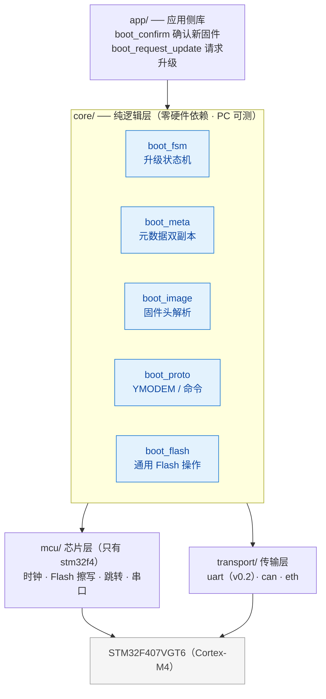
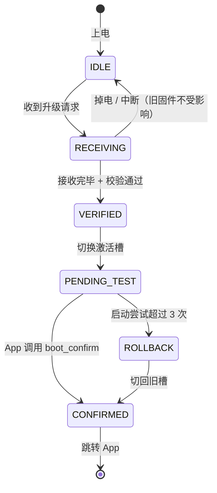

<div align="center">

# 🚀 Cortex-M OTA Boot

**面向 STM32F407（Cortex-M4）的 A/B 双分区 OTA Bootloader**

单芯片专用 · 掉电安全回滚 · 核心逻辑可在 PC 上做断电注入测试

[](LICENSE)
[](#-硬件要求)
[](#-仓库结构)
[](https://github.com/1duck-duck1/cortex-m-ota-boot/actions/workflows/ci.yml)
[](CHANGELOG.md)
[](#-贡献)

</div>

> [!NOTE]
> **当前状态：v0.2.0 开发中**
> v0.1.0 双向跳转闭环已交付；v0.2.0 迭代中已完成 Flash 分区对称化（A/B 各 384 KB）、Boot/App 两侧链接边界收窄、跨复位通信迁移至 `.noinit` SRAM 邮箱。App 侧 `boot_client` 集成与 UART 升级通道开发中。真板验收步骤见 [实现详解 §6](docs/04-boot-implementation.md)。当前构建基于 Keil MDK-ARM（AC5）；快速开始一节的 CMake 工具链为目标形态。

---

## 📖 目录

- [🚀 Cortex-M OTA Boot](#-cortex-m-ota-boot)
  - [📖 目录](#-目录)
  - [🎯 这是什么](#-这是什么)
  - [✨ 为什么用它](#-为什么用它)
  - [🔧 硬件要求](#-硬件要求)
  - [🗺️ Flash 分区布局](#️-flash-分区布局)
  - [🏗️ 架构](#️-架构)
  - [🔄 升级流程](#-升级流程)
  - [✅ 功能清单](#-功能清单)
    - [核心功能](#核心功能)
  - [🚀 快速开始](#-快速开始)
  - [🛣️ 路线图](#️-路线图)
  - [📁 仓库结构](#-仓库结构)
  - [📚 文档](#-文档)
  - [⚠️ 风险提示](#️-风险提示)
  - [🤝 贡献](#-贡献)
  - [📄 许可证](#-许可证)

---

## 🎯 这是什么

一个裸机 Bootloader + OTA 升级方案，只面向 STM32F407VGT6（Cortex-M4，1 MB Flash）。

三个设计目标：

| 目标 | 含义 |
|---|---|
| 🧩 **A/B 双槽** | 新固件只写入非激活槽；切换只是提交一次元数据，全程不碰正在运行的固件 |
| ⚡ **掉电安全** | 升级过程中任意时刻断电，重新上电必然回到一个可启动的状态 |
| 🧪 **可测试** | 核心逻辑与硬件解耦，可在 PC 上跑断电注入单元测试，无需目标板 |

## ✨ 为什么用它

| 差异点 | 同类项目现状 |
|---|---|
| 只把 F407 这一件事做透：12 个大小不均的 sector 全部对齐，无"理论可用但没在真板验证"的分支 | 通用项目往往留着一堆没验过的移植分支 |
| 掉电安全提供**可复现的测试数据**，而非仅声称支持 | 多数项目只写一句"支持掉电恢复" |
| 核心逻辑可在 **PC 上单元测试**，包括断电注入测试 | 几乎没有同类项目做 |
| 分区与数据格式**按 sector 粒度推导并写进文档**，含"元数据双副本必须跨 sector"这类硬约束 | 分区表往往一句话带过，坑留给使用者踩 |

## 🔧 硬件要求

| 平台 | 型号 | Flash | SRAM |
|---|---|---|---|
| **Cortex-M4** | STM32F407VGT6 | 1 MB / 12 sector（16 / 64 / 128 KB 三种粒度） | 128 KB（另有 64 KB CCM，本项目不使用） |

市面上常见的 F407VGT6 开发板即可，无需自制硬件。

## 🗺️ Flash 分区布局

**STM32F407VGT6 · 1 MB · 12 sector**

| 区域 | 地址范围 | 大小 | 占用 sector |
|---|---|---|---|
| Bootloader | `0x08000000` – `0x08007FFF` | 32 KB | 0 – 1 |
| Metadata | `0x08008000` – `0x0800FFFF` | 32 KB | 2 – 3 |
| 参数数据区 | `0x08010000` – `0x0801FFFF` | 64 KB | 4 |
| Slot A | `0x08020000` – `0x0807FFFF` | 384 KB | 5 – 7 |
| Slot B | `0x08080000` – `0x080DFFFF` | 384 KB | 8 – 10 |
| 保留 | `0x080E0000` – `0x080FFFFF` | 128 KB | 11 |

> [!IMPORTANT]
> **元数据为什么占两个 sector**：F4 的擦除单元是整个 sector。双副本若挤在同一个 sector 里，擦除其中一份会连另一份一起擦掉，"任意时刻至少一份有效"这条掉电安全地基就不成立了。所以两份副本必须各占一个独立 sector。

> [!NOTE]
> 两槽**等大**（各 384 KB），打包工具只需一条容量规则。sector 4 是唯一的 64 KB sector，划入任一槽都会破坏等容，因此独立作参数数据区（NVS 预留）；sector 11 整块保留，擦除任一槽都不波及其他区域，保留区可存放需长期存活的数据（如救援镜像、崩溃日志）。

## 🏗️ 架构



依赖方向严格单向：`core` 只依赖 `mcu` 与 `transport` 的**接口**。`core` 被保留下来的唯一理由是"能在 PC 上跑断电注入测试"——掉电安全这件事必须能自动化验证，而不是靠手拔电碰运气。

## 🔄 升级流程



> [!IMPORTANT]
> **核心不变式：任意时刻断电，下次上电必然回到一个可启动的状态。**
> 这是整个项目最重要的一条设计约束，全部实现细节都服务于它。

## ✅ 功能清单

图例：✅ 已实现 · 🚧 进行中 · 📋 计划中

### 核心功能

| 编号 | 功能 | 状态 |
|---|---|:---:|
| F-01 | 应用有效性校验（magic / CRC / HW ID） | 🚧 SP/PC 范围检查已实现，CRC 待 v0.2 |
| F-02 | 应用跳转（VTOR / MSP / 外设反初始化） | ✅ |
| F-03 | 应用侧请求进入 Bootloader | 🚧 数据层就绪，App 集成随 v0.2.0 |
| F-04 | 启动失败保护 | ✅ 计数拒跳；自动回滚待双槽（v0.3） |
| F-05 | 传输抽象层 | 📋 |
| F-06 | YMODEM 接收（含重传与超时） | 📋 |
| F-08 | 固件头解析 | 📋 |
| F-09 | 固件合法性校验 | 📋 |
| F-10 | 元数据双副本原子更新 | 📋 |
| F-11 | 升级状态机 | 📋 |
| F-12 | A/B 分区切换 | 📋 |
| F-13 | 掉电安全 | 📋 |
| F-14 | 启动失败自动回滚 | 📋 |
| F-15 | 应用侧确认接口 | 🚧 数据层就绪，App 集成随 v0.2.0 |
| F-16 | 自身分区写保护 | 📋 |
| F-17 | 固件打包工具 | 📋 |
| F-18 | 上位机升级工具 | 📋 |
| F-19 | 串口命令行 | 📋 |
| F-21 | PC 端单元测试 | 📋 |

<details>
<summary><b>计划中的增强功能</b></summary>

Ed25519 签名校验、防回滚、固件加密、CAN 传输、双 Bank 无搬运升级、Factory 救援固件。

</details>

<details>
<summary><b>明确不做的事（防止范围蔓延）</b></summary>

Bootloader 自更新、差分升级、云平台/服务器端、图形化上位机、全厂商芯片覆盖、RTOS 深度集成、动态内存分配。

</details>

完整的功能范围与取舍理由见 [项目规划](docs/00-project-plan.md)。

## 🚀 快速开始

**当前（v0.2.0 开发中，Keil MDK-ARM + AC5）**——用 Keil 分别打开两个工程，编译并烧录：

```text
Keil_OTA_Boot/MDK-ARM/Keil_OTA_Boot.uvprojx   ← Bootloader（0x08000000，32 KB 边界）
Keil_App/MDK-ARM/Keil_App.uvprojx             ← 应用工程（0x08020000，Slot A）
```

烧录顺序与邮箱观察方法见 [实现详解 §6](docs/04-boot-implementation.md)。App 侧 `boot_client` 集成开发中，完成前双向跳转闭环暂不可用。

**目标形态（CMake + GCC 工具链，随 v0.2.0 起逐步落地）**：

```bash
# 1. 获取代码
git clone https://github.com/1duck-duck1/cortex-m-ota-boot.git
cd cortex-m-ota-boot

# 2. 编译 Bootloader 与示例 App
cmake -B build/f407 -G Ninja -DBOARD=stm32f407_demo
cmake --build build/f407

# 3. 烧录后，通过串口升级
ota flash --port COM3 firmware.pkg
```

**工具链依赖**：当前仅需 Keil MDK-ARM 5.38+（AC5）；目标形态另需 `arm-none-eabi-gcc` · `cmake` · `ninja` · Python 3.8+

## 🛣️ 路线图

| 版本 | 内容 | 验收标准 |
|:---:|---|---|
| **v0.1.0** | 最小 Bootloader，双向跳转 | STM32F407VGT6 真板上双向跳转成功 |
| **v0.2.0** | UART + YMODEM 升级到非激活槽 | 手动完成一次完整升级 |
| **v0.3.0** | 掉电安全状态机 + 回滚 | PC 模拟 500 次随机断电全恢复 · 真板拔电 100 次全恢复 |
| **v0.4.0** | Ed25519 签名 + 防回滚 | 篡改固件被拒绝 |
| **v0.5.0** | Python 上位机（pip 可装） | 一条命令完成升级 |
| **v1.0.0** | 接口冻结 + 完整文档 | 外部开发者照文档在 F407 上独立完成一次升级 |

> [!TIP]
> `v0.3.0` 是项目的质变点：它证明"任意时刻断电都能恢复"这条不变式真的成立。这条验收标准是硬性的 —— 做不到就回退重构，不许用"多试几次就好了"掩盖。

## 📁 仓库结构

```text
.
├── Keil_OTA_Boot/            Bootloader 工程（Keil MDK-ARM）
│   ├── Boot/                 核心模块（conf / flag / flash / jump / main）
│   ├── Core/                 CubeMX 生成（时钟 / GPIO / 中断）
│   ├── Drivers/              ST 官方代码（CMSIS + HAL 最小子集）
│   └── MDK-ARM/              工程文件 + 链接脚本（32 KB 边界）
├── Keil_App/                 应用工程（Keil MDK-ARM，链接到 Slot A）
│   ├── Core/                 CubeMX 生成（USART1/2 · TIM2）
│   ├── Drivers/              ST 官方代码
│   └── MDK-ARM/              工程文件 + 链接脚本（0x08020000 起）
├── docs/                     设计与实现文档
└── .github/workflows/        CI
```

> [!TIP]
> 规划中的 `core` / `mcu` / `transport` 分层（纯逻辑层 PC 可测，见 [架构设计](docs/01-architecture.md)）将在 v0.2.0 引入传输层时落地，v0.1.0 按"最小闭环"纪律直接以 Keil 工程交付。

## 📚 文档

| 文档 | 内容 |
|---|---|
| [项目规划](docs/00-project-plan.md) | 定位、功能清单、里程碑与验收标准、开源运营、风险清单 |
| [架构设计](docs/01-architecture.md) | 分层架构、芯片层接口、分区布局、数据格式、升级状态机、F4 平台约束 |
| [开发指南](docs/02-git-and-github.md) | Git 配置、提交规范、分支策略、文档写作规范 |
| [代码风格](docs/03-code-style.md) | 命名规范、CubeMX 区纪律、注释与格式硬性纪律 |
| [实现详解](docs/04-boot-implementation.md) | v0.1.0 实现决策记录：BKP 通信、跳转清单逐项分析、掉电窗口、已知妥协、上板验收手册 |

## ⚠️ 风险提示
> [!CAUTION]
> **固件升级操作有使设备无法启动的风险。**
>
> - 本方案的掉电安全机制经充分测试后，可保证升级过程断电不损坏已有固件
> - 但**首次烧录 Bootloader 本身**仍需使用 SWD / JTAG 编程器
> - 若设备已无法启动，始终可以通过 SWD 接口重新烧录恢复
> - 请勿在量产设备上直接测试未经充分验证的版本

## 🤝 贡献

欢迎提交 Issue 与 PR。开始之前请阅读 [开发指南](docs/02-git-and-github.md)，其中包含提交规范与分支策略。

- 🐛 发现 Bug → 提 Issue
- 💡 有新想法 → 先提 Issue 讨论，避免做无用功
- 💻 想贡献代码 → 从标记 `good first issue` 的任务开始

## 📄 许可证

[Apache License 2.0](LICENSE) · 允许商用，需保留版权声明与许可声明

<div align="center">

**如果这个项目对你有帮助，点个 ⭐ 是最好的鼓励**

</div>