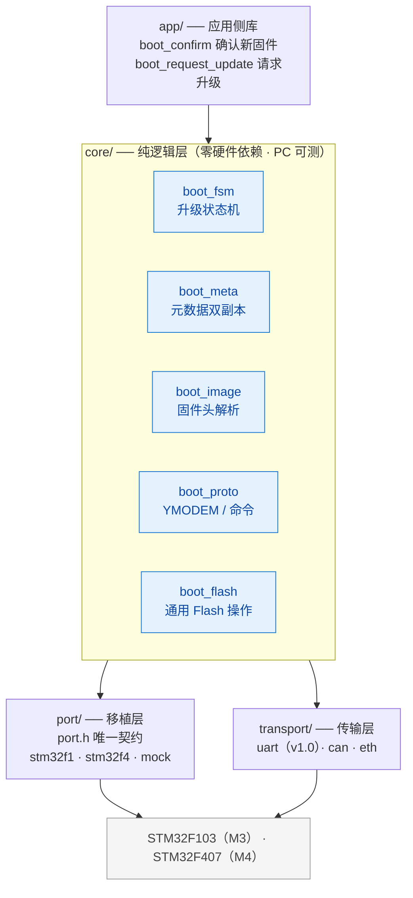
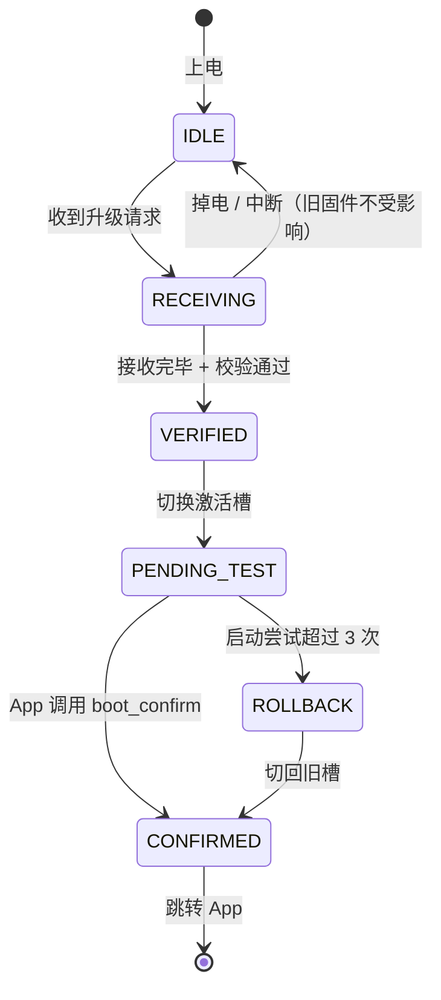

<div align="center">

# 🚀 Cortex-M OTA Boot

**面向 Cortex-M3/M4 的可移植 A/B 双分区 OTA Bootloader**

同一套核心逻辑，经 STM32F103 与 STM32F407 两块真实板子验证 · 支持掉电安全回滚

[](LICENSE)
[](#-硬件要求)
[](#-仓库结构)
[](https://github.com/1duck-duck1/cortex-m-ota-boot/actions/workflows/ci.yml)
[](CHANGELOG.md)
[](#-贡献)

</div>

> [!WARNING]
> **项目处于早期规划阶段（v0.0.0）**
> 代码尚未提交，当前仓库仅包含设计与规划文档。快速开始一节描述的是目标形态，将在 v0.1.0 起逐步可用。

---

## 📖 目录

- [这是什么](#-这是什么)
- [为什么用它](#-为什么用它)
- [硬件要求](#-硬件要求)
- [Flash 分区布局](#-flash-分区布局)
- [架构](#-架构)
- [升级流程](#-升级流程)
- [功能清单](#-功能清单)
- [快速开始](#-快速开始)
- [路线图](#-路线图)
- [仓库结构](#-仓库结构)
- [文档](#-文档)
- [风险提示](#-风险提示)
- [贡献](#-贡献)
- [许可证](#-许可证)

---

## 🎯 这是什么

一个裸机 Bootloader + OTA 升级方案，适用于 STM32F103（Cortex-M3）与 STM32F407（Cortex-M4）。

三个设计目标：

| 目标 | 含义 |
|---|---|
| 🧩 **可移植** | 移植到新芯片 = 实现 [`code/port/port.h`](code/port/port.h) 的接口 + 填一份分区布局，核心逻辑不动 |
| ⚡ **掉电安全** | 升级过程中任意时刻断电，重新上电必然回到一个可启动的状态 |
| 🧪 **可测试** | 核心逻辑与硬件完全解耦，可在 PC 上跑单元测试，无需目标板 |

## ✨ 为什么用它

| 差异点 | 同类项目现状 |
|---|---|
| 可移植性由**两块真实板子的移植过程验证**，而非口头声明 | 大多数项目只在一款芯片上跑通 |
| 核心逻辑可在 **PC 上单元测试**，包括断电注入测试 | 几乎没有同类项目做 |
| 掉电安全提供**可复现的测试数据**，而非仅声称支持 | 多数项目只写一句"支持掉电恢复" |
| 明确的**移植契约**：1 个头文件 + 一组函数 + 一份分区布局 | 移植说明含糊或缺失 |

## 🔧 硬件要求

| 平台 | 型号 | 角色 |
|---|---|---|
| **Cortex-M3** | STM32F103（512 KB Flash / 2 KB page） | 主参考平台 |
| **Cortex-M4** | STM32F407（1 MB Flash / 12 sector） | 用于验证可移植性 |

两块板子均为市面上最常见的开发板型号，无需自制硬件。

## 🗺️ Flash 分区布局

**STM32F407 · 1 MB**

| 区域 | 地址范围 | 大小 | 占用 sector |
|---|---|---|---|
| Bootloader | `0x08000000` – `0x0800BFFF` | 48 KB | 0 – 2 |
| Metadata | `0x0800C000` – `0x0800FFFF` | 16 KB | 3 |
| Slot A | `0x08010000` – `0x0807FFFF` | 448 KB | 4 – 7 |
| Slot B | `0x08080000` – `0x080FFFFF` | 512 KB | 8 – 11 |

> [!NOTE]
> 两个 Slot 大小不等（448 KB vs 512 KB），这是 F4 sector 粒度不均的客观约束，不是设计缺陷。元数据中记录各槽实际大小，打包时按 `min(A, B)` 校验固件体积。

<details>
<summary>STM32F103 分区布局（512 KB / page 2 KB）</summary>

| 区域 | 地址范围 | 大小 | 占用 page |
|---|---|---|---|
| Bootloader | `0x08000000` – `0x08003FFF` | 16 KB | 0 – 7 |
| Metadata | `0x08004000` – `0x08004FFF` | 4 KB | 8 – 9 |
| Slot A | `0x08005000` – `0x08040FFF` | 240 KB | 10 – 129 |
| Slot B | `0x08041000` – `0x0807CFFF` | 240 KB | 130 – 249 |

</details>

## 🏗️ 架构



依赖方向严格单向：`core` 只依赖 `port` 与 `transport` 的**接口**，永远不知道自己在哪块芯片上运行。

## 🔄 升级流程



> [!IMPORTANT]
> **核心不变式：任意时刻断电，下次上电必然回到一个可启动的状态。**
> 这是整个项目最重要的一条设计约束，全部实现细节都服务于它。

## ✅ 功能清单

图例：✅ 已实现 · 🚧 进行中 · 📋 计划中

### 核心功能

| 编号 | 功能 | 状态 |
|---|---|:---:|
| F-01 | 应用有效性校验（magic / CRC / HW ID） | 📋 |
| F-02 | 应用跳转（VTOR / MSP / 外设反初始化） | 📋 |
| F-03 | 应用侧请求进入 Bootloader | 📋 |
| F-04 | 启动失败保护 | 📋 |
| F-05 | 传输抽象层 | 📋 |
| F-06 | YMODEM 接收（含重传与超时） | 📋 |
| F-08 | 固件头解析 | 📋 |
| F-09 | 固件合法性校验 | 📋 |
| F-10 | 元数据双副本原子更新 | 📋 |
| F-11 | 升级状态机 | 📋 |
| F-12 | A/B 分区切换 | 📋 |
| F-13 | 掉电安全 | 📋 |
| F-14 | 启动失败自动回滚 | 📋 |
| F-15 | 应用侧确认接口 | 📋 |
| F-16 | 自身分区写保护 | 📋 |
| F-17 | 固件打包工具 | 📋 |
| F-18 | 上位机升级工具 | 📋 |
| F-19 | 串口命令行 | 📋 |
| F-20 | 移植契约与移植指南 | 📋 |
| F-21 | PC 端单元测试 | 📋 |

<details>
<summary><b>计划中的增强功能</b></summary>

Ed25519 签名校验、防回滚、固件加密、CAN 传输、双 Bank 无搬运升级、Factory 救援固件。

</details>

<details>
<summary><b>明确不做的事（防止范围蔓延）</b></summary>

Bootloader 自更新、差分升级、云平台/服务器端、图形化上位机、全厂商芯片覆盖、RTOS 深度集成、动态内存分配。

</details>

完整的功能范围与取舍理由见 [项目规划](docs/00-project-plan.md)。

## 🚀 快速开始
```bash
# 1. 获取代码
git clone https://github.com/1duck-duck1/cortex-m-ota-boot.git
cd cortex-m-ota-boot

# 2. 编译 Bootloader（以 F407 为例）
cmake -B build/f407 -G Ninja -DBOARD=stm32f407_demo
cmake --build build/f407

# 3. 烧录后，通过串口升级
ota flash --port COM3 firmware.pkg
```

**工具链依赖**：`arm-none-eabi-gcc` · `cmake` · `ninja` · Python 3.8+

## 🛣️ 路线图

| 版本 | 内容 | 验收标准 |
|:---:|---|---|
| **v0.1.0** | 最小 Bootloader，双向跳转 | F103 真板上双向跳转成功 |
| **v0.2.0** | UART + YMODEM 升级到非激活槽 | 手动完成一次完整升级 |
| **v0.3.0** | 掉电安全状态机 + 回滚 | PC 模拟 500 次随机断电全恢复 · 真板拔电 100 次全恢复 |
| **v0.4.0** | 移植 F407，发布移植指南 | **除 `port/stm32f4/` 外未修改 `core/` 任何文件** |
| **v0.5.0** | Ed25519 签名 + 防回滚 | 篡改固件被拒绝 |
| **v0.6.0** | Python 上位机（pip 可装） | 一条命令完成升级 |
| **v1.0.0** | 接口冻结 + 完整文档 | 第三方能照文档成功移植到新芯片 |

> [!TIP]
> `v0.3.0` 与 `v0.4.0` 是项目的两个质变点。前者证明掉电安全，后者证明架构真的可移植。这两条验收标准是硬性的 —— 违反了就回退重构，不许在 `core/` 里打补丁。

## 📁 仓库结构

```text
.
├── code/                     源代码
│   ├── core/                 纯逻辑层（零硬件依赖）
│   ├── port/                 移植层
│   │   ├── port.h            ★ 移植契约
│   │   ├── stm32f1/
│   │   ├── stm32f4/
│   │   └── mock/             PC 端模拟实现
│   ├── transport/            传输层（uart / can）
│   ├── app/                  应用侧库
│   ├── bsp/                  示例工程
│   ├── tools/                固件打包与上位机
│   └── tests/                PC 端单元测试
├── docs/                     设计与规划文档
└── .github/workflows/        CI
```

## 📚 文档

| 文档 | 内容 |
|---|---|
| [项目规划](docs/00-project-plan.md) | 定位、功能清单、里程碑与验收标准、开源运营、风险清单 |
| [架构设计](docs/01-architecture.md) | 分层架构、移植契约、分区布局、数据格式、升级状态机、平台约束 |
| [开发指南](docs/02-git-and-github.md) | Git 配置、提交规范、分支策略、文档写作规范 |

## ⚠️ 风险提示
> [!CAUTION]
> **固件升级操作有使设备无法启动的风险。**
>
> - 本方案的掉电安全机制经充分测试后，可保证升级过程断电不损坏已有固件
> - 但**首次烧录 Bootloader 本身**仍需使用 SWD / JTAG 编程器
> - 若设备已无法启动，始终可以通过 SWD 接口重新烧录恢复
> - 请勿在量产设备上直接测试未经充分验证的版本

## 🤝 贡献

欢迎提交 Issue 与 PR。开始之前请阅读 [开发指南](docs/02-git-and-github.md)，其中包含提交规范与分支策略。

- 🐛 发现 Bug → 提 Issue
- 💡 有新想法 → 先提 Issue 讨论，避免做无用功
- 💻 想贡献代码 → 从标记 `good first issue` 的任务开始

## 📄 许可证

[Apache License 2.0](LICENSE) · 允许商用，需保留版权声明与许可声明

<div align="center">

**如果这个项目对你有帮助，点个 ⭐ 是最好的鼓励**

</div>