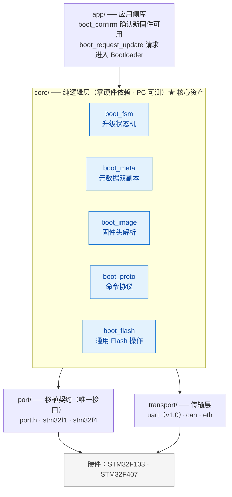
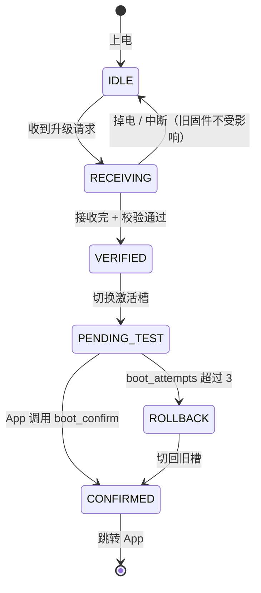

# 01 架构设计

> [!NOTE]
> 本文是项目的技术图纸。功能范围与版本规划见 [00-project-plan.md](00-project-plan.md)。

---

## 1. 设计铁律

这三条是硬约束，违反即视为架构错误，必须回退重构。

| # | 铁律 | 含义 |
|---|---|---|
| R-1 | **F103 跑通前不写任何抽象层** | 可移植性是从第二块板子"抠"出来的结果，不是设计出来的前提 |
| R-2 | **移植新芯片只允许修改 `code/port/<chip>/`** | 若移植时改了 `core/`，说明抽象错了，重构抽象而非打补丁 |
| R-3 | **`core/` 零硬件依赖，可在 PC 上编译运行** | 凡引用寄存器、HAL、平台宏，都是架构违规 |

配套验证手段：`code/tests/` 里的 mock port 把 Flash 模拟成一段 RAM 数组，`core/` 的所有逻辑都在这上面跑单元测试。

---

## 2. 分层架构



**依赖方向严格单向**：`core` 依赖 `port` 与 `transport` 的**接口**，`port` / `transport` 的实现依赖硬件。`core` 永远不知道自己是跑在 F1 还是 F4 上。

---

## 3. 目录结构

仓库根目录只有文档与构建文件，全部源代码归入 `code/`。

```
.
├── README.md
├── LICENSE                      Apache-2.0
├── CHANGELOG.md
├── .gitignore
├── CMakeLists.txt               顶层构建（v0.1.0 引入）
│
├── code/                        全部源代码
│   │
│   ├── core/                    纯 C，零硬件依赖
│   │   ├── boot_fsm.c/.h        升级状态机
│   │   ├── boot_meta.c/.h       元数据双副本读写
│   │   ├── boot_image.c/.h      固件头解析与校验
│   │   ├── boot_flash.c/.h      通用 Flash 操作（擦除单元感知）
│   │   ├── boot_proto.c/.h      YMODEM + 命令协议
│   │   ── boot_cfg.h           全局编译期配置
│   │
│   ├── port/
│   │   ├── port.h               ★唯一移植契约
│   │   ├── stm32f1/             分区布局 + port 实现 + 启动汇编
│   │   ├── stm32f4/             同上 + RamFunc 支持
│   │   └── mock/                PC 端模拟实现（供 tests 使用）
│   │
│   ├── transport/
│   │   ├── transport.h          接口定义
│   │   └── uart/                串口实现
│   │
│   ├── app/                     App 侧链接的库
│   │   ├── boot_client.c/.h     确认 / 请求升级
│   │   └── boot_client_cfg.h
│   │
│   ├── bsp/
│   │   ├── stm32f103_demo/      完整示例工程（Boot + App）
│   │   └── stm32f407_demo/
│   │
│   ├── tools/
│   │   ├── firmware_pack.py     固件打包（追加头部）
│   │   └── ota_tool/            上位机升级工具
│   │
│   └── tests/                   PC 端单元测试
│       ├── test_fsm.c
│       ├── test_meta_powerloss.c  掉电模拟测试
│       └── test_image.c
│
├── docs/
│   ├── 00-project-plan.md       项目规划（定位 / 功能清单 / 里程碑）
│   ├── 01-architecture.md       本文档
│   ├── 02-git-and-github.md     开发与协作指南
│   ├── porting-guide.md         ★v1.0 核心资产
│   └── power-loss-design.md     掉电安全设计
│
└── .github/
    ├── workflows/ci.yml         编译 + 单元测试
    └── ISSUE_TEMPLATE/
```

> [!NOTE]
> `CODE_OF_CONDUCT.md`、`CONTRIBUTING.md`、Issue/PR 模板在 GitHub 仓库公开后补充。

---

## 4. 移植契约：`code/port/port.h`

这是整个项目最重要的文件。移植一款新芯片 = 实现这些函数 + 填一份分区布局。

```c
#ifndef BOOT_PORT_H
#define BOOT_PORT_H

#include <stdint.h>
#include <stddef.h>

/* 标记函数需常驻 RAM 执行（F4 擦写 Flash 时的硬性要求，见第 8 节） */
#if defined(BOOT_PORT_RAMFUNC)
#define BOOT_RAMFUNC  BOOT_PORT_RAMFUNC
#else
#define BOOT_RAMFUNC
#endif

typedef struct {
    uint32_t start;          /* 区域起始地址 */
    uint32_t size;           /* 区域大小（字节） */
} boot_region_t;

typedef struct {
    /* ---- 分区布局（每个芯片一份） ---- */
    boot_region_t boot;         /* Bootloader 自身区域 */
    boot_region_t meta;         /* 元数据区域（含双副本） */
    boot_region_t slot[2];      /* Slot A / Slot B */

    /* ---- Flash 基本能力 ---- */
    int      (*init)(void);
    int      (*deinit)(void);

    /* 返回 addr 所在擦除单元的起始地址与大小。
       F1 的擦除单元是 page（1/2 KB），F4 是 sector（16/64/128 KB），
       且 F4 各 sector 大小不均，因此必须用函数在运行时查询。 */
    uint32_t (*erase_unit_base)(uint32_t addr);
    uint32_t (*erase_unit_size)(uint32_t addr);

    int      (*erase)(uint32_t addr, uint32_t len);   /* len 必须为擦除单元整数倍 */
    int      (*write)(uint32_t addr, const void *buf, uint32_t len);
    int      (*read)(uint32_t addr, void *buf, uint32_t len);

    /* ---- 启动控制 ---- */
    uint32_t (*app_entry_get)(uint32_t slot_base);    /* 由向量表取 Reset_Handler */
    uint32_t (*app_stack_get)(uint32_t slot_base);    /* 由向量表取初始 MSP */
    void     (*periph_deinit)(void);                  /* 关外设、清 NVIC、停 SysTick */
    void     (*jump)(uint32_t entry, uint32_t stack);
    void     (*system_reset)(void);

    /* ---- 升级请求标志（备份寄存器或保留 RAM） ---- */
    void     (*boot_flag_set)(uint32_t flag);
    uint32_t (*boot_flag_get)(void);
    void     (*boot_flag_clear)(void);
} boot_port_t;

/* 每个 port/<chip>/ 提供此函数，返回该芯片的布局与实现 */
const boot_port_t *boot_port_get(void);

#endif /* BOOT_PORT_H */
```

### 设计要点说明

- **`erase_unit_base/size` 必须是函数**：这是抹平 F1（均匀 page）与 F4（不均 sector）差异的关键。`core` 只使用"擦除单元"这个概念，任何地方都不允许出现 `FLASH_PAGE_SIZE` 这类平台宏。
- **`erase` 的长度语义按擦除单元处理**：`core` 负责把请求对齐到擦除单元边界，`port` 负责实际擦除。
- **`app_entry_get/app_stack_get` 而非直接读地址**：不同内核向量表布局有差异，由 `port` 封装。
- **`boot_flag_*` 抽出为接口**：F1/F4 可用 BKP 备份寄存器，将来某些芯片可能只能用保留 RAM，差异在此处吸收。

---

## 5. Flash 分区布局

### 5.1 STM32F407（1 MB，12 sector，大小不均）

Flash 物理布局：

| Sector | 起始地址 | 大小 |
|---|---|---|
| 0 | 0x08000000 | 16 KB |
| 1 | 0x08004000 | 16 KB |
| 2 | 0x08008000 | 16 KB |
| 3 | 0x0800C000 | 16 KB |
| 4 | 0x08010000 | 64 KB |
| 5–11 | 0x08020000 起 | 各 128 KB |

项目布局：

| 区域 | 起止地址 | 大小 | 占用 sector |
|---|---|---|---|
| Bootloader | 0x08000000 – 0x0800BFFF | 48 KB | 0 – 2 |
| Metadata | 0x0800C000 – 0x0800FFFF | 16 KB | 3 |
| Slot A | 0x08010000 – 0x0807FFFF | 448 KB | 4 – 7 |
| Slot B | 0x08080000 – 0x080FFFFF | 512 KB | 8 – 11 |

**注意槽不等大**（448 KB vs 512 KB）。这是 F4 sector 粒度的客观约束，不是设计缺陷。

处理方式（这本身就是"通用框架"的试金石）：
1. 元数据中记录每个槽的**实际 size**；
2. 打包工具按 `min(slot[0].size, slot[1].size)` 校验固件体积，超限直接拒绝打包；
3. `core` 切换槽时读取元数据中的 size，不假设两槽等大。

### 5.2 STM32F103（以 512 KB / page 2 KB 版本为例）

| 区域 | 起止地址 | 大小 | 占用 page |
|---|---|---|---|
| Bootloader | 0x08000000 – 0x08003FFF | 16 KB | 0 – 7 |
| Metadata | 0x08004000 – 0x08004FFF | 4 KB | 8 – 9 |
| Slot A | 0x08005000 – 0x08040FFF | 240 KB | 10 – 129 |
| Slot B | 0x08041000 – 0x0807CFFF | 240 KB | 130 – 249 |

F103 的 page 是均匀的（C8 系列为 1 KB，ZE 系列为 2 KB），所以两槽可以做到等大。**具体数值以实际型号为准，必须按 page 对齐后填入 `code/port/stm32f1/` 的布局结构体。**

### 5.3 布局配置的形式

每个 `code/port/<chip>/` 下提供一份布局定义：

```c
/* code/port/stm32f4/boot_layout_f407.c */
static const boot_port_t s_port_f407 = {
    .boot = { 0x08000000, 48  * 1024 },
    .meta = { 0x0800C000, 16  * 1024 },
    .slot = {
        { 0x08010000, 448 * 1024 },   /* Slot A */
        { 0x08080000, 512 * 1024 },   /* Slot B */
    },
    .init = f4_flash_init,
    /* ... */
};
```

换芯片时只改这份结构体与对应的几个函数，`core` 完全不动。

---

## 6. 数据格式

### 6.1 固件头（64 字节，附加在 `.bin` 之前）

```c
#define BOOT_IMAGE_MAGIC      0x544F4F42u   /* 'BOOT' */
#define BOOT_IMAGE_HEADER_VER 1u

typedef struct {
    uint32_t magic;          /* BOOT_IMAGE_MAGIC */
    uint16_t header_ver;     /* 头部格式版本，用于将来扩展 */
    uint16_t hw_id;          /* 目标硬件标识，防止烧错板子 */
    uint32_t fw_version;     /* 固件版本，单调递增（供 X-02 防回滚使用） */
    uint32_t image_size;     /* 载荷大小，不含头部 */
    uint32_t load_offset;    /* 相对槽起始的加载偏移，通常为 0 */
    uint32_t payload_crc32;  /* 载荷 CRC32 */
    uint32_t header_crc32;   /* 本结构前 28 字节的 CRC32 */
    uint8_t  reserved[24];   /* 预留：SHA256 / 签名域（X-01） */
    uint8_t  pad[4];         /* 补齐到 64 字节 */
} boot_image_header_t;
```

**校验顺序（任一失败即拒绝）**：
1. `magic == BOOT_IMAGE_MAGIC`
2. `header_ver` 在支持范围内
3. `header_crc32` 校验通过
4. `hw_id` 与当前硬件匹配
5. `image_size <= 目标槽可用容量`
6. `payload_crc32` 与实收载荷匹配
7. （v0.5 起）签名验证

**为什么固件头放在最前面**：Bootloader 只需读前 64 字节就能判断固件是否合法，无需扫描整个镜像。

### 6.2 元数据（双副本，原子更新）

```c
#define BOOT_META_MAGIC  0x4154454Du   /* 'META' */

/* 单个槽的状态 */
typedef enum {
    SLOT_INVALID = 0,      /* 无有效固件 */
    SLOT_VALID,            /* 有有效固件，可作为回滚目标 */
    SLOT_PENDING_TEST,     /* 已切到此槽，等待 App 确认 */
} boot_slot_state_t;

typedef struct {
    uint32_t          version;
    uint32_t          size;         /* 该槽固件实际大小（解决槽不等大问题） */
    uint32_t          crc32;
    uint8_t           state;
    uint8_t           reserved[3];
} boot_slot_info_t;

typedef struct {
    uint32_t          magic;        /* BOOT_META_MAGIC */
    uint32_t          seq;          /* 单调递增序号，越大越新 */
    uint8_t           active_slot;  /* 0 = A, 1 = B */
    uint8_t           boot_attempts;/* 当前激活槽已尝试启动次数 */
    uint16_t          reserved;
    boot_slot_info_t  slot[2];      /* Slot A / Slot B 信息 */
    uint32_t          crc32;        /* 本结构前 N 字节的 CRC32 */
} boot_meta_t;
```

**原子更新算法**（`code/core/boot_meta.c` 实现，与平台无关）：

```
写记录(新 meta):
  1. 找到两份副本中 seq 较小的那一份（即"旧的"）
  2. 擦除该副本所在擦除单元
  3. 写入完整的新记录，其 seq = 当前最大 seq + 1
  4. 回读校验 CRC

读记录(上电时):
  1. 逐份检查 magic 与 CRC
  2. 取所有有效副本中 seq 最大的一份
  3. 若两份都无效（极端情况）→ 视为出厂状态，槽状态全置 SLOT_INVALID
```

**容错边界**：擦除/写入过程中掉电，只会损坏"旧的那份"，另一份始终有效。这是掉电安全的基础。

---

## 7. 升级状态机

### 7.1 状态定义与上电行为

| 状态 | 含义 | 上电时的行为 |
|---|---|---|
| `IDLE` | 无升级进行中 | 校验激活槽固件，有效则跳转 App，无效则停在 Bootloader |
| `RECEIVING` | 正在接收固件，写入非激活槽 | 非激活槽内容不完整 → 标记 `SLOT_INVALID`，回到 `IDLE`，旧固件不受影响 |
| `VERIFIED` | 接收完毕，校验全部通过，等待切换 | 执行切换：`active_slot` 指向新槽，状态置 `PENDING_TEST`，`boot_attempts = 0` |
| `PENDING_TEST` | 已切到新槽，等待 App 确认 | `boot_attempts++`；若 `> MAX_ATTEMPTS(3)` → 回滚到旧槽；否则跳转 App |
| `CONFIRMED` | 新固件已确认可用 | 将新槽标记 `SLOT_VALID`，旧槽保留为回滚目标，跳转 App |
| `ROLLBACK` | 新固件启动失败，切回旧槽 | 恢复 `active_slot` 为旧槽，状态置 `CONFIRMED`，跳转旧 App；若无有效旧槽则停在 Bootloader |

### 7.2 状态转换图



### 7.3 核心不变式

> [!IMPORTANT]
> **任意时刻断电，下次上电必然回到一个可启动的状态。**

推论（这些是设计检查清单）：

1. 固件**只写入非激活槽**，激活槽在切换完成前不被触碰 → 接收阶段断电，旧固件完好；
2. 元数据**始终有一份完整有效副本** → 元数据写入阶段断电也能恢复；
3. 切换动作是**单次元数据提交**，是原子的 → 不存在"切了一半"的状态；
4. 新固件**必须先通过启动验证**才能转为 `CONFIRMED` → 坏固件不会永久占据激活槽。

### 7.4 回滚的判定机制

Bootloader 无法直接知道 App 是否"成功运行"，采用**启动尝试计数**：

1. 切到新槽时 `boot_attempts = 0`；
2. 每次上电处于 `PENDING_TEST` 时 `boot_attempts++` 并立即提交元数据；
3. App 正常启动后调用 `boot_confirm()` → 状态转 `CONFIRMED`，计数清零；
4. 若 App 反复崩溃/看门狗复位，`boot_attempts` 会累积到超过 `MAX_ATTEMPTS`（默认 3）→ 触发回滚。

**注意**：`boot_attempts++` 必须在跳转 App **之前**提交，否则 App 崩溃后计数不会累积。

---

## 8. 平台关键约束

### 8.1 F4 擦写期间必须常驻 RAM（★最容易踩的坑）

**STM32F407 在擦写 Flash 期间，CPU 从 Flash 取指会 stall，表现为随机 HardFault 或卡死。** F103 有 prefetch buffer，通常问题不大，但 F4 的 ART Accelerator 不能容忍。

处理方式：

1. `code/port/stm32f4/` 定义 `BOOT_PORT_RAMFUNC` 为 `__attribute__((section(".RamFunc"), noinline))`；
2. 链接脚本中把 `.RamFunc` 段放在 RAM，并在启动时由 Bootloader 从 Flash 拷贝过去；
3. **凡是会被 `erase/write` 调用到的函数（含 `core` 中参与擦写的函数）都必须用 `BOOT_RAMFUNC` 标记**；
4. 擦写期间关闭全局中断，或确保所有中断处理函数也在 RAM 中。

这条约束是移植契约的一部分，必须写进 `docs/porting-guide.md`。

### 8.2 跳转 App 的必要动作

顺序不能错：

1. 关闭全局中断（`__disable_irq()`）；
2. 关闭所用外设的时钟与中断，清除所有 NVIC pending 位；
3. 停止 SysTick，关闭看门狗（或由 App 重新配置）；
4. （F4）清理 FPU 的 lazy stacking 状态（`FPU->FPCCR` 的 ASPEN/LSPEN）；
5. （F4）关闭 ART 相关特殊配置，恢复到复位默认值；
6. 从 App 向量表读取初始 MSP 与 Reset_Handler（由 `port` 封装）；
7. 设置 `SCB->VTOR = slot_base`；
8. 设置 MSP，跳转到 Reset_Handler。

若第 3 步的看门狗需要跨跳转保留，必须在 App 启动早期立即重新配置并喂狗。

### 8.3 其他硬约束

| 约束 | 说明 |
|---|---|
| 禁动态内存 | Bootloader 全程静态分配，禁止 `malloc` |
| 禁止在 Bootloader 中使用全套 HAL | 用寄存器或裁剪后的 LL 层，保证 48 KB 内装得下 |
| Bootloader 不与 App 共享外设状态 | 跳转前必须反初始化，App 自行重新初始化 |
| 元数据写入前必须校验边界 | 拒绝任何落在 Bootloader 区或元数据区的擦写请求（F-16） |
| 固件头必须在最前面 | 只读 64 字节即可完成初步合法性判断 |

---

## 9. 测试策略

### 9.1 PC 端单元测试（`code/tests/`，优先级最高）

用 `code/port/mock/` 把 Flash 模拟成一段 RAM 数组，即可在 PC 上验证 `core/` 全部逻辑，无需硬件、可在 CI 中跑。

| 测试 | 内容 |
|---|---|
| `test_image.c` | 固件头校验：magic / CRC / HW ID / 超容量 各类非法输入 |
| `test_meta.c` | 元数据双副本：正常写、单副本损坏、序号选取、两份全损坏 |
| `test_fsm.c` | 状态机所有转换路径，含非法转换拒绝 |
| `test_meta_powerloss.c` | **★核心测试**：在元数据写入的每个字节位置注入断电，重新上电后断言必然恢复到可启动状态 |
| `test_rollback.c` | 模拟 App 连续崩溃，验证 `boot_attempts` 累积并触发回滚 |

**掉电注入的实现思路**：mock port 支持一个 `fail_after_n_writes` 参数，每执行 N 次写操作后让后续写入静默失败（模拟掉电），外层循环 N 从 1 递增到写操作总数，逐一验证恢复结果。这个测试通过后，你的项目就有了别家没有的可信数据。

### 9.2 真板测试

1. **基础功能**：升级成功、升级失败拒绝、HW ID 不匹配拒绝；
2. **断电测试**：手动或继电器在接收过程中随机断电，重复 100 次，验证旧固件始终可用；
3. **回滚测试**：故意烧一个会崩溃的 App，验证 3 次后自动回滚；
4. **移植测试**：在 F407 上重复上述全部项目。

### 9.3 CI（`.github/workflows/ci.yml`）

每次 push 与 PR 触发：

1. 用 `arm-none-eabi-gcc` 编译 F103 与 F407 两份 Bootloader 工程；
2. 用 host gcc 编译并运行 `code/tests/` 全部单元测试；
3. 编译上位机 Python 工具并跑 `flake8` / `pytest`。

CI 绿勾是从第一天就该养成的习惯。

---

## 10. 与规划文档的对应关系

| 架构章节 | 对应功能编号 |
|---|---|
| §4 移植契约 | F-20 |
| §5 分区布局 | F-12、F-16 |
| §6.1 固件头 | F-08、F-09 |
| §6.2 元数据 | F-10、F-13 |
| §7 状态机 | F-11、F-14、F-15 |
| §8.2 跳转 | F-02、F-03、F-04 |
| §9 测试 | F-21、X-07 |