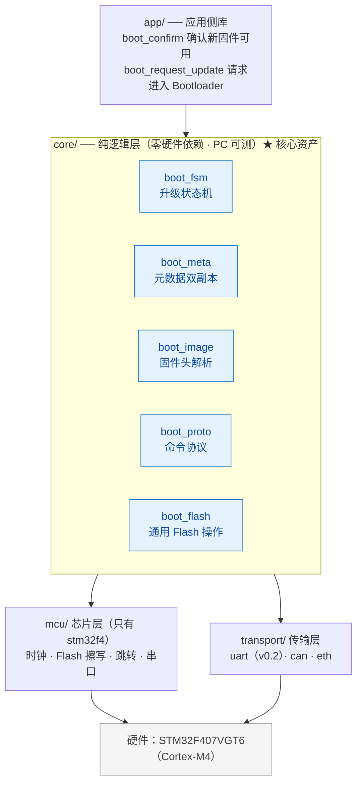
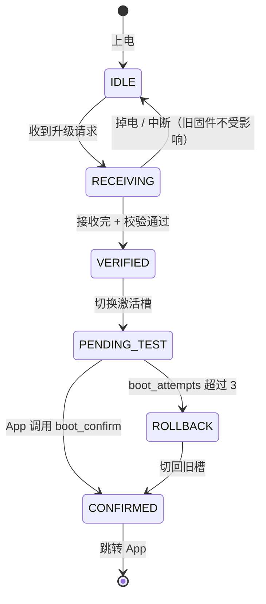

# 01 架构设计

> [!NOTE]
> 本文是项目的技术图纸。功能范围与版本规划见 [00-project-plan.md](00-project-plan.md)。

---

## 1. 设计铁律

这三条是硬约束，违反即视为架构错误，必须回退重构。

| # | 铁律 | 含义 |
|---|---|---|
| R-1 | **F407 跑通前不写任何抽象层** | 抽象是从跑通的代码里"抠"出来的结果，不是设计出来的前提。`core/` 在 v0.3.0 之前根本不存在 |
| R-2 | **硬件相关代码只允许出现在 `code/mcu/stm32f4/`** | 一旦 `core/` 里出现寄存器、HAL 或平台宏，说明分层错了——重构分层，而不是打补丁 |
| R-3 | **`core/` 零硬件依赖，可在 PC 上编译运行** | 这是"掉电安全可以被自动化验证"的前提：拔电测试不能只靠手拔 |

配套验证手段：`code/tests/mock/` 把 Flash 模拟成一段 RAM 数组（且**照抄 F4 的不均 sector 尺寸表**），`core/` 的所有逻辑都在这上面跑单元测试。

---

## 2. 分层架构



**依赖方向严格单向**：`core` 依赖 `mcu` 与 `transport` 的**接口**，芯片层实现依赖硬件。

`core` 存在的理由只有一个：**让 "任意时刻断电都能恢复" 这条不变式可以被自动化验证**。把逻辑锁死在真板中断电重试，永远拿不到可信数据。所以这里的"分层"不是为了可移植，而是为了可测试——这是本项目放弃多芯片支持后，仍然保留 `core/` 的原因。

---

## 3. 目录结构

仓库根目录只有文档与构建文件，全部源代码归入 `code/`。

```
.
├── README.md
├── LICENSE                   Apache-2.0
├── CHANGELOG.md
├── .gitignore
├── CMakeLists.txt            顶层构建（v0.1.0 引入）
│
├── Drivers/                  ST 官方代码（vendored 最小子集，非本项目源码）
│   ├── CMSIS/                内核与设备头文件、启动文件、system_stm32f4xx.c
│   └── STM32F4xx_HAL_Driver/ 只拷贝用到的模块（rcc / uart / gpio / ...）
│
├── code/                     全部源代码
│   │
│   ├── core/                 纯 C，零硬件依赖（v0.3.0 引入）
│   │   ├── boot_fsm.c/.h     升级状态机
│   │   ├── boot_meta.c/.h    元数据双副本读写
│   │   ├── boot_image.c/.h   固件头解析与校验
│   │   ├── boot_flash.c/.h   通用 Flash 操作（擦除单元感知）
│   │   ├── boot_proto.c/.h   YMODEM + 命令协议
│   │   └── boot_cfg.h        全局编译期配置
│   │
│   ├── mcu/                  芯片层：唯一允许出现寄存器的目录
│   │   ├── mcu.h             接口定义（core 与芯片层之间）
│   │   └── stm32f4/          时钟 · Flash 擦写 · 跳转 · 串口 · 启动汇编 · 链接脚本
│   │
│   ├── transport/            传输层
│   │   ├── transport.h       接口定义
│   │   └── uart/             串口实现
│   │
│   ├── app/                  App 侧链接的库
│   │   ├── boot_client.c/.h  确认 / 请求升级
│   │   └── boot_client_cfg.h
│   │
│   ├── bsp/                  示例工程
│   │   └── stm32f407_demo/   完整示例工程（Boot + App + fake_app）
│   │
│   ├── tools/                固件打包与上位机
│   │   ├── firmware_pack.py  固件打包（追加头部）
│   │   └── ota_tool/         上位机升级工具
│   │
│   └── tests/                PC 端单元测试
│       ├── mock/             模拟芯片层（RAM 当 Flash + 掉电注入）
│       ├── test_image.c
│       ├── test_meta.c
│       ├── test_meta_powerloss.c
│       └── test_fsm.c
│
├── docs/
│   ├── 00-project-plan.md    项目规划（定位 / 功能清单 / 里程碑）
│   ├── 01-architecture.md    本文档
│   ├── 02-git-and-github.md  开发与协作指南
│   └── power-loss-design.md  掉电安全设计
│
└── .github/
    ├── workflows/ci.yml      编译 + 单元测试
    └── ISSUE_TEMPLATE/
```

> [!NOTE]
> `Drivers/` 采用 vendored 最小子集而不是引入 CubeF4 子模块：整个 CubeF4 仓库数百 MB，clone 即劝退；最小子集可保证 CI 可复现。该目录是第三方代码，不受 R-2 约束——R-2 管的是**本项目**代码的组织方式。
>
> `CODE_OF_CONDUCT.md`、`CONTRIBUTING.md`、Issue/PR 模板在 GitHub 仓库公开后补充。

---

## 4. 芯片层接口：`code/mcu/mcu.h`

这个头文件从 v0.3.0 起存在（见 R-1）。它**不是为了将来移植到别的芯片**（N-05 已经否掉了这条路），唯一目的是让 `core/` 能在 PC 上被编译和测试：

- 目标板实现：`code/mcu/stm32f4/`，直接操作 F4 寄存器；
- PC 侧实现：`code/tests/mock/`，把 Flash 模拟成一段 RAM 数组，并提供"第 N 次写之后掉电"的注入开关。

所以这里不存在"可移植性"的承诺，只有一条能被检验的要求：**同一份 `core/` 逻辑，在真板与 PC 上给出同样的行为。**

```c
#ifndef BOOT_MCU_H
#define BOOT_MCU_H

#include <stdint.h>
#include <stddef.h>

/* 标记函数需常驻 RAM 执行（F4 擦写 Flash 时的硬性要求，见第 8 节） */
#if defined(BOOT_MCU_RAMFUNC)
#define BOOT_RAMFUNC  BOOT_MCU_RAMFUNC
#else
#define BOOT_RAMFUNC
#endif

typedef struct {
    uint32_t start;          /* 区域起始地址 */
    uint32_t size;           /* 区域大小（字节） */
} boot_region_t;

typedef struct {
    /* ---- 分区布局（真板与 mock 各一份，数值必须一致） ---- */
    boot_region_t boot;         /* Bootloader 自身区域 */
    boot_region_t meta;         /* 元数据区域（含双副本） */
    boot_region_t slot[2];      /* Slot A / Slot B */

    /* ---- Flash 基本能力 ---- */
    int      (*init)(void);
    int      (*deinit)(void);

    /* 返回 addr 所在擦除单元的起始地址与大小。
       F4 的擦除单元是 sector，且 12 个 sector 大小不均（16/64/128 KB），
       因此必须用函数在运行时查询 —— 任何地方都不允许写死 sector 尺寸。 */
    uint32_t (*erase_unit_base)(uint32_t addr);
    uint32_t (*erase_unit_size)(uint32_t addr);

    int      (*erase)(uint32_t addr, uint32_t len);   /* len 必须为擦除单元整数倍 */
    int      (*write)(uint32_t addr, const void *buf, uint32_t len);
    int      (*read)(uint32_t addr, void *buf, uint32_t len);

    /* ---- 启动控制 ---- */
    uint32_t (*app_entry_get)(uint32_t slot_base);    /* 由向量表取 Reset_Handler */
    uint32_t (*app_stack_get)(uint32_t slot_base);    /* 由向量表取初始 MSP */
    void     (*periph_deinit)(void);                  /* 关外设、清 NVIC、停 SysTick */
    void     (*jump)(uint32_t entry, uint32_t stack);
    void     (*system_reset)(void);

    /* ---- 升级请求标志（F4 用 .noinit SRAM 邮箱，实现见 04-boot-implementation.md §1） ---- */
    void     (*boot_flag_set)(uint32_t flag);
    uint32_t (*boot_flag_get)(void);
    void     (*boot_flag_clear)(void);
} boot_mcu_t;

/* 真板与 mock 各提供一份实现 */
const boot_mcu_t *boot_mcu_get(void);

#endif /* BOOT_MCU_H */
```

### 设计要点说明

- **`erase_unit_base/size` 必须是函数**：F4 的 sector 大小不均，`core` 只使用"擦除单元"这个概念，任何地方都不允许出现 `FLASH_SECTOR_SIZE` 这类平台宏。
- **mock 必须照抄真实的 sector 尺寸表**，而不是一段等大的假 Flash——否则测不出"跨 sector 边界被擦坏"这类真实缺陷，而元数据双副本恰好就卡在这个边界上。
- **`erase` 的长度语义按擦除单元处理**：`core` 负责把请求对齐到擦除单元边界，芯片层负责实际擦除。
- **`app_entry_get/app_stack_get` 而非直接读地址**：向量表取值这一步由芯片层封装，`core` 不假设 Cortex-M4 之外的内核布局。
- **`boot_flag_*` 抽出为接口**：真板用 BKP 备份寄存器，mock 用一个静态变量，差异在此处吸收。

---

## 5. Flash 分区布局

### 5.1 STM32F407 物理 sector 布局

F407VGT6 的 1 MB Flash 由 12 个 sector 组成，**大小不均**：

| Sector | 起始地址 | 大小 |
|---|---|---|
| 0 | 0x08000000 | 16 KB |
| 1 | 0x08004000 | 16 KB |
| 2 | 0x08008000 | 16 KB |
| 3 | 0x0800C000 | 16 KB |
| 4 | 0x08010000 | 64 KB |
| 5 – 11 | 0x08020000 起 | 各 128 KB |

擦除单元是**整个 sector**——这一条事实决定了下面所有取舍。

### 5.2 项目布局

| 区域 | 起止地址 | 大小 | 占用 sector |
|---|---|---|---|
| Bootloader | 0x08000000 – 0x08007FFF | 32 KB | 0 – 1 |
| Metadata | 0x08008000 – 0x0800FFFF | 32 KB | 2 – 3 |
| 参数数据区 | 0x08010000 – 0x0801FFFF | 64 KB | 4 |
| Slot A | 0x08020000 – 0x0807FFFF | 384 KB | 5 – 7 |
| Slot B | 0x08080000 – 0x080DFFFF | 384 KB | 8 – 10 |
| 保留 | 0x080E0000 – 0x080FFFFF | 128 KB | 11 |

三条推导理由：

1. **元数据的两个副本必须落在不同 sector**。擦除单元是整个 sector，双副本若同处一个 sector，更新其中一份就会把另一份一起擦掉，"任意时刻至少一份有效"这条地基直接失效。所以 Metadata 取 32 KB＝sector 2 + sector 3，一份副本占一个 sector。
2. **Boot + Meta 把 4 个小 sector（共 64 KB）一次吃干净**；sector 4 划为参数数据区，两个槽从 sector 5 的 128 KB 边界开始，槽内擦除永远不会波及前面的区域。
3. **A/B 两槽等大（各 384 KB）**，打包工具只需要一条容量规则。sector 4 是唯一的 64 KB sector，划入任一槽都会破坏等容，因此独立作参数数据区（NVS 预留）；sector 11 整块保留，擦除任一槽都不波及其他区域，保留区可存放需长期存活的数据（如救援镜像、崩溃日志）。

> [!CAUTION]
> **不要为了"省那 64 KB"把 Slot B 扩到 512 KB。** 两槽不等大意味着打包校验、元数据格式、上位机三处都要处理两套容量，而收益只有 64 KB——这是典型的用复杂度换微小空间。

### 5.3 布局以什么形式存在

真板与 mock 各提供一份布局结构体，**数值必须逐字一致**（不一致等于测了个假的）：

```c
/* code/mcu/stm32f4/mcu_stm32f4.c */
static const boot_mcu_t s_mcu_f407 = {
    .boot = { 0x08000000, 32  * 1024 },
    .meta = { 0x08008000, 32  * 1024 },   /* 副本 0 在 sector 2，副本 1 在 sector 3 */
    .slot = {
        { 0x08020000, 384 * 1024 },       /* Slot A */
        { 0x08080000, 384 * 1024 },       /* Slot B */
    },
    .init = f4_flash_init,
    /* ... */
};
```

---

## 6. 数据格式

> [!NOTE]
> 本节结构以 `Keil_OTA_Boot/Boot/boot_types.h` 与 `boot_conf.h` 的实际定义为准（单一事实来源）。v0.1 时期的 64 字节固件头草案已废弃；`reserved` 域在 F-17 打包工具落地时再评估是否扩展。

### 6.1 固件头（32 字节，附加在镜像之前）

```c
#define BOOT_IMAGE_MAGIC      0x494D4742u   /* 小端字节序：'BGMI' */
#define BOOT_IMAGE_HEADER_VERSION  1u
#define BOOT_HARDWARE_ID       0xF4070001u

typedef struct {
    uint32_t magic;            /* BOOT_IMAGE_MAGIC */
    uint32_t header_version;   /* 头部格式版本 */
    uint32_t header_size;      /* 本结构大小，sizeof(boot_image_header_t) */
    uint32_t hardware_id;      /* 目标硬件标识，防烧错板子 */
    uint32_t firmware_version; /* 固件版本，单调递增（供 X-02 防回滚使用） */
    uint32_t image_size;      /* 载荷大小，不含头部 */
    uint32_t load_address;    /* 载荷目标地址（相对槽基址的绝对地址） */
    uint32_t image_crc32;     /* 载荷 CRC32 */
} boot_image_header_t;
```

**校验顺序（任一失败即拒绝，F-08/F-09 随传输链路接入）**：
1. `magic == BOOT_IMAGE_MAGIC`
2. `header_version` 在支持范围内，`header_size` 与 sizeof 一致
3. `hardware_id` 与当前硬件匹配
4. `image_size <= 目标槽可用容量`（`BOOT_MAX_IMAGE_SIZE`）
5. `image_crc32` 与实收载荷匹配
6. （v0.4.0 起）签名验证

**为什么固件头放在最前面**：Bootloader 只需读前 32 字节就能判断固件是否合法，无需扫描整个镜像。

### 6.2 元数据（双副本，原子更新）

```c
#define BOOT_METADATA_MAGIC  0x4154454Du   /* 小端字节序：'META' */
#define BOOT_METADATA_VERSION 1u

/* 单个槽的记录 */
typedef struct {
    uint32_t state;          /* boot_image_state_t：EMPTY/VALID/PENDING/CONFIRMED/INVALID */
    uint32_t version;
    uint32_t image_size;
    uint32_t image_crc32;
} boot_slot_record_t;

typedef struct {
    uint32_t          magic;          /* BOOT_METADATA_MAGIC */
    uint32_t          format_version;
    uint32_t          record_size;    /* sizeof(boot_metadata_t)，自校验 */
    uint32_t          sequence;       /* 单调递增，越大越新；奇偶决定写入哪份副本 */
    uint32_t          active_slot;    /* 当前激活槽（boot_slot_id_t） */
    uint32_t          confirmed_slot; /* 上一次确认过的槽，回滚目标 */
    uint32_t          pending_slot;   /* 待验证的切换目标（NONE = 无切换进行中） */
    uint32_t          boot_attempts; /* 激活槽连续启动计数（F-04） */
    boot_slot_record_t slot_a;
    boot_slot_record_t slot_b;
    uint32_t          record_crc32;   /* 本结构 record_crc32 之前字节的 CRC32 */
} boot_metadata_t;
```

三槽字段（`active / confirmed / pending`）比"单 active + 槽状态"表达力更强：**回滚目标显式化**（confirmed 不随切换变）、**切换进行中**可被任何一次复位后的 load 识别（pending ≠ NONE → 按新槽继续尝试或计数超限回滚）。

副本 A 落在 sector 2（`BOOT_META_A_ADDR`），副本 B 落在 sector 3（`BOOT_META_B_ADDR`）——**各自独占一个 sector，这是分区布局为它让出 32 KB 的原因**。

**原子更新算法**（`Boot/boot_metadata.c` 已实现）：

```
写记录(commit):
  1. 补齐 magic / format_version / record_size，重算 record_crc32
  2. 按 sequence 奇偶选目标副本（偶数写 A，奇数写 B）
  3. 擦除目标副本所在 sector
  4. 写入完整新记录（sequence 已由调用方递增）
  5. 回读并用同样的校验规则验证

读记录(load):
  1. 逐份检查 magic / format_version / record_size / record_crc32
  2. 两份均有效时取 sequence 较大者；仅一份有效取该份
  3. 两份都无效（出厂或极端损坏）→ 视为出厂状态：
     active=A, confirmed=A, pending=NONE, slot_a=VALID, sequence=0
```

**容错边界**：擦除/写入过程中掉电，只会损坏"目标那份"，另一份位于**另一个 sector**、不受擦除影响，始终有效。这是掉电安全的基础（逐断电点分析见 [04-boot-implementation.md](04-boot-implementation.md) §3）。

---

## 7. 升级状态机

### 7.1 状态定义与上电行为

| 状态 | 含义 | 上电时的行为 |
|---|---|---|
| `IDLE` | 无升级进行中 | 校验激活槽固件，有效则跳转 App，无效则停在 Bootloader |
| `RECEIVING` | 正在接收固件，写入非激活槽 | 非激活槽内容不完整 → 标记 `SLOT_INVALID`，回到 `IDLE`，旧固件不受影响 |
| `VERIFIED` | 接收完毕，校验全部通过，等待切换 | 执行切换：`active_slot` 指向新槽，状态置 `PENDING_TEST`，`boot_attempts = 0` |
| `PENDING_TEST` | 已切到新槽，等待 App 确认 | `boot_attempts++`；若 `> MAX_ATTEMPTS(3)` → 回滚到旧槽；否则跳转 App |
| `CONFIRMED` | 新固件已确认可用 | 将新槽标记 `SLOT_VALID`，旧槽保留为回滚目标，跳转 App |
| `ROLLBACK` | 新固件启动失败，切回旧槽 | 恢复 `active_slot` 为旧槽，状态置 `CONFIRMED`，跳转旧 App；若无有效旧槽则停在 Bootloader |

> [!NOTE]
> **v0.2.0 实现现状**：拒跳（attempts 超限）后 `boot_metadata_rollback` 只完成"元数据回滚"（active 切回 confirmed、计数清零），随后停留 WAIT_UPDATE 等 UART 通道，**不自动跳转旧槽**——"回滚后跳转"随 v0.3.0 状态机完善接通。当前 `confirmed_slot` 无有效旧槽时同样停留 Bootloader，安全侧一致。

### 7.2 状态转换图



### 7.3 核心不变式

> [!IMPORTANT]
> **任意时刻断电，下次上电必然回到一个可启动的状态。**

推论（这些是设计检查清单）：

1. 固件**只写入非激活槽**，激活槽在切换完成前不被触碰 → 接收阶段断电，旧固件完好；
2. 元数据**始终有一份完整有效副本** → 元数据写入阶段断电也能恢复；
3. 切换动作是**单次元数据提交**，是原子的 → 不存在"切了一半"的状态；
4. 新固件**必须先通过启动验证**才能转为 `CONFIRMED` → 坏固件不会永久占据激活槽。

### 7.4 回滚的判定机制

Bootloader 无法直接知道 App 是否"成功运行"，采用**启动尝试计数**：

1. 切到新槽时 `boot_attempts = 0`；
2. 每次上电处于 `PENDING_TEST` 时 `boot_attempts++` 并立即提交元数据；
3. App 正常启动后调用 `boot_confirm()` → 状态转 `CONFIRMED`，计数清零；
4. 若 App 反复崩溃/看门狗复位，`boot_attempts` 会累积到超过 `MAX_ATTEMPTS`（默认 3）→ 触发回滚。

**注意**：`boot_attempts++` 必须在跳转 App **之前**提交，否则 App 崩溃后计数不会累积。

**confirm 的消费同样必须落盘**：无论是否存在进行中的切换（pending），消费确认标志时都要把"计数清零"提交进元数据——只改 RAM 不提交的话，下次上电会从元数据读回旧计数继续累积，最终误触回滚；App 每次启动都确认而元数据本就干净（pending==NONE 且计数==0）时才可跳过提交，避免无谓擦写。

---

## 8. 平台关键约束

### 8.1 F4 擦写期间必须常驻 RAM（★最容易踩的坑）

**STM32F407 在擦写 Flash 期间，CPU 从 Flash 取指会 stall，表现为随机 HardFault 或卡死**——ART Accelerator 不能容忍这种访问冲突。这是本项目最容易踩、也最容易被误判成"偶发 bug"的坑。

处理方式：

1. `code/mcu/stm32f4/` 定义 `BOOT_MCU_RAMFUNC` 为 `__attribute__((section(".RamFunc"), noinline))`；
2. 链接脚本中把 `.RamFunc` 段放在 RAM，并在启动时由 Bootloader 从 Flash 拷贝过去；
3. **凡是会被 `erase/write` 调用到的函数（含 `core` 中参与擦写的函数）都必须用 `BOOT_RAMFUNC` 标记**；
4. 擦写期间关闭全局中断，或确保所有中断处理函数也在 RAM 中。

这条约束必须写进 README 的"注意事项"，否则使用者照抄时必然踩。

### 8.2 跳转 App 的必要动作

顺序不能错：

1. 关闭全局中断（`__disable_irq()`）；
2. 关闭所用外设的时钟与中断，清除所有 NVIC pending 位；
3. 停止 SysTick，关闭看门狗（或由 App 重新配置）；
4. 清理 FPU 的 lazy stacking 状态（`FPU->FPCCR` 的 ASPEN/LSPEN）；
5. 关闭 ART 相关特殊配置，恢复到复位默认值；
6. 从 App 向量表读取初始 MSP 与 Reset_Handler（由芯片层封装）；
7. 设置 `SCB->VTOR = slot_base`；
8. 设置 MSP，跳转到 Reset_Handler。

若第 3 步的看门狗需要跨跳转保留，必须在 App 启动早期立即重新配置并喂狗。

> [!WARNING]
> **第 8 步不要用 C 局部变量去承载 MSP。** "改栈指针"这个动作会让编译器认为后续所有局部变量都已失效，却又允许它把变量溢出到即将废弃的旧栈上。用一小段汇编直接 `msr msp` + `bx` 跳转，是唯一不会出错的做法。

### 8.3 其他硬约束

| 约束 | 说明 |
|---|---|
| 禁动态内存 | Bootloader 全程静态分配，禁止 `malloc` |
| HAL 只按 §8.4 的混合策略使用 | App 全 HAL；Bootloader 中 HAL 仅限非擦写路径（时钟/串口，必须轮询模式），Flash 擦写必须寄存器级 + RAMFUNC |
| Bootloader 不与 App 共享外设状态 | 跳转前必须反初始化，App 自行重新初始化 |
| 元数据写入前必须校验边界 | 拒绝任何落在 Bootloader 区或元数据区的擦写请求（F-16） |
| 固件头必须在最前面 | 只读 64 字节即可完成初步合法性判断 |

### 8.4 HAL 使用策略（混合制）

| 层 | 允许的库 | 理由 |
|---|---|---|
| App | 全 HAL | 跳转后 HAL 从零初始化，无任何约束 |
| Bootloader 时钟/串口等 | HAL（必须轮询模式）或 LL | 这些代码不在擦写执行路径上（§8.1），不触碰 RAMFUNC 约束 |
| Bootloader Flash 擦写 | **只允许寄存器级**（约 150 行） | 三条理由见下 |

Flash 擦写不用 HAL 的三条理由：

1. **F4 的 Flash 外设没有 LL 库**——ST 只提供 HAL 或裸寄存器两种选择，"轻量官方库"这条路不存在；
2. **RAMFUNC 约束会传染 HAL 调用链**（§8.1）：`HAL_FLASH_Program` 及其内部函数必须整体编译进 RAM 段；HAL 版本升级可能悄悄引入新的 Flash 驻留调用，构建侧无法自动发现；
3. **HAL 的超时机制在擦写期间失效**：`FLASH_WaitForLastOperation` 的超时依赖 `HAL_GetTick()`，而擦写期间全局关中断、tick 冻结——Flash 出错时超时永远不会触发，变成无界死循环。寄存器级实现用有界循环计数轮询 BSY，天然免疫。

反过来，N-05（单芯片专用）也消解了"寄存器代码难维护"的顾虑：F4 的擦写序列（KEYR 解锁 → SER/SNB → STRT → BSY 轮询 → 锁定）十年未变，这份驱动是一次性投入。

> [!NOTE]
> **实现现状**：`Boot/boot_flash.c` 已按本节落地——寄存器级擦写 + 有界循环轮询 BSY（`BOOT_FLASH_TIMEOUT_LOOP`，约 5 s），不依赖 SysTick 超时。RAMFUNC（§8.1）暂缓：Bootloader 单任务环境下"Flash 中执行、擦写期间取指 stall"可接受，v0.3 引入中断驱动传输时再迁移（决策记录见 [04-boot-implementation.md](04-boot-implementation.md) §7 妥协 #5）。

---

## 9. 测试策略

### 9.1 PC 端单元测试（`code/tests/`，优先级最高）

用 `code/tests/mock/` 把 Flash 模拟成一段 RAM 数组，即可在 PC 上验证 `core/` 全部逻辑，无需硬件、可在 CI 中跑。

| 测试 | 内容 |
|---|---|
| `test_image.c` | 固件头校验：magic / CRC / HW ID / 超容量 各类非法输入 |
| `test_meta.c` | 元数据双副本：正常写、单副本损坏、序号选取、两份全损坏 |
| `test_fsm.c` | 状态机所有转换路径，含非法转换拒绝 |
| `test_meta_powerloss.c` | **★核心测试**：在元数据写入的每个字节位置注入断电，重新上电后断言必然恢复到可启动状态 |
| `test_rollback.c` | 模拟 App 连续崩溃，验证 `boot_attempts` 累积并触发回滚 |

**掉电注入的实现思路**：mock 支持一个 `fail_after_n_writes` 参数，执行 N 次写操作后让后续写入静默失败（模拟掉电），外层循环 N 从 1 递增到写操作总数，逐一验证恢复结果。这个测试通过后，项目就有了别家没有的可信数据。

> [!IMPORTANT]
> mock 的 sector 尺寸表必须与 F407 一致（16/64/128 KB）。如果 mock 用等大的假 sector，就永远测不出"副本 0 与副本 1 是否落在同一 sector"这类致命缺陷。

### 9.2 真板测试

1. **基础功能**：升级成功、升级失败拒绝、HW ID 不匹配拒绝；
2. **断电测试**：手动或继电器在接收过程中随机断电，重复 100 次，验证旧固件始终可用；
3. **回滚测试**：故意烧一个会崩溃的 App，验证 3 次后自动回滚；
4. **反向跳转**：App 按约定（BKP 标志）请求进入 Bootloader，验证能进入且不无限循环。

### 9.3 CI（`.github/workflows/ci.yml`）

每次 push 与 PR 触发：

1. 用 `arm-none-eabi-gcc` 编译 `code/bsp/stm32f407_demo/` 下的 Boot / App / fake_app 三个目标；
2. 用 host gcc 编译并运行 `code/tests/` 全部单元测试；
3. 用 `flake8` / `pytest` 检查上位机 Python 工具（v0.2.0 起目录非空后启用）。

CI 绿勾是从第一天就该养成的习惯。

---

## 10. 与规划文档的对应关系

| 架构章节 | 对应功能编号 |
|---|---|
| §4 芯片层接口 | F-21（PC 端测试的前提） |
| §5 分区布局 | F-12、F-16 |
| §6.1 固件头 | F-08、F-09 |
| §6.2 元数据 | F-10、F-13 |
| §7 状态机 | F-11、F-14、F-15 |
| §8.2 跳转 | F-02、F-03、F-04 |
| §9 测试 | F-21、X-07 |