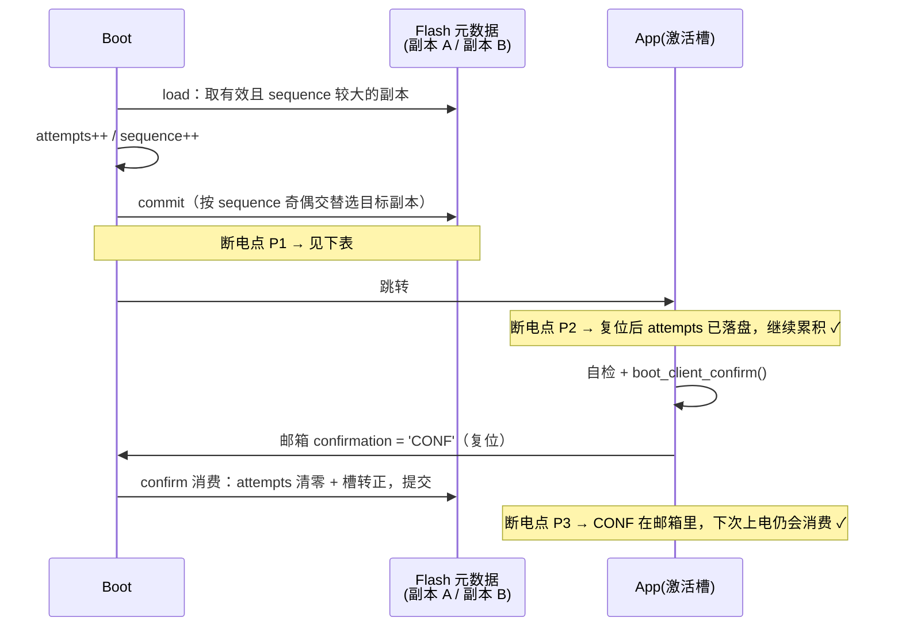

# 🛠️ 04 Bootloader 实现详解

 

> 📚 **系列导航**：[00 规划](00-project-plan.md) · [01 架构](01-architecture.md) · [02 Git](02-git-and-github.md) · [03 风格](03-code-style.md) · [04 实现](04-boot-implementation.md) · [05 对标](05-bootloader-landscape.md)

> [!NOTE]
> 本文档记录**当前已交付代码**（v0.1.0 → v0.2.0-dev）的实现决策与难点，与 [01-architecture.md](01-architecture.md) 的分工是：架构文档回答"应该怎么做"，本文档回答"**实际怎么做的、为什么、哪里是妥协**"。代码位于 `Keil_OTA_Boot/`（Keil MDK-ARM + AC5 工程），应用工程为 `Keil_App/`。v0.1.0 的 BKP 通信决策作为历史记录保留在 §1.4。

## 📋 0. 交付范围与代码地图

v0.2.0-dev 的完成度：跳转闭环 + Flash 分区对称化 + 跨复位通信（SRAM 邮箱）+ 元数据双副本 + 寄存器级 Flash 驱动。**尚未串联**：App 侧 `boot_client` 集成（Keil_App 为 CubeMX 骨架）、UART + YMODEM 接收链路——双向闭环当前不可用，随 v0.2.0 收尾补齐。

| 文件 | 职责 | 对应功能 |
|---|---|---|
| `Boot/boot_conf.h` | 分区表 / 邮箱与元数据格式 / 魔数 / 阈值，单一事实来源 | — |
| `Boot/boot_types.h` | 公共类型：状态码 / 槽 ID / 镜像头 / 元数据结构 | — |
| `Boot/boot_flag.c/.h` | `.noinit` SRAM 邮箱跨复位通信（magic + CRC32 双重校验） | F-03 / F-15 数据层 |
| `Boot/boot_crc.c/.h` | CRC32（元数据记录与将来固件头校验共用） | F-09 数据层 |
| `Boot/boot_flash.c/.h` | 寄存器级 Flash 擦写（有界轮询）+ 写范围守卫 | F-16 部分 |
| `Boot/boot_metadata.c/.h` | 元数据双副本：load / commit / 切换 / 确认 / 回滚 | F-10 / F-12 / F-14 数据层 |
| `Boot/boot_jump.c/.h` | 向量表校验 + 环境剥离 + 跳转 | F-01（简化版）/ F-02 |
| `Boot/boot_main.c/.h` | 8 状态状态机主流程 | F-03 / F-04 / F-11 |
| `Keil_OTA_Boot/Core/Src/main.c` | CubeMX 生成，USER CODE 区接入 `boot_run()` | — |
| `Keil_App/Core/Src/main.c` | 应用工程骨架（USART1/2 + TIM2 已配置、全部待启动） | `boot_client` 集成待办 |

三个此刻还没做的事（对应架构文档铁律 R-1"允许写死、允许代码丑"）：

- **输出通道**：USART1/2 已由 CubeMX 配好（115200，TX/RX），但无任何收发逻辑；验证仍靠 Keil 调试断点 + SRAM 邮箱观察
- **固件校验**：仍只做 SP/PC 范围检查；`boot_crc` 模块已就绪但校验链尚未接入（理由见 §2.1）
- **接收链路**：YMODEM 未动工，`boot_conf.h` 的 `BOOT_PROTOCOL_MAX_DATA`（1024）等宏为它预留

## 📮 1. 跨复位通信：`.noinit` SRAM 邮箱

### 1.1 载体演进与对比

Boot 与 App 之间需要一条"软件复位后还在"的通信信道（请求升级 / 确认 / 计数）。候选载体对比：

| 载体 | 软件复位保持 | 掉电保持 | 容量 | 完整性校验 | 结论 |
|---|:---:|:---:|---|---|---|
| 普通 SRAM（.data/.bss） | ✗ 启动代码清零/重拷 | ✗ | — | — | 不可用 |
| **`.noinit` SRAM 邮箱** | ✓ 链接器不触碰 | ✗ | 32 字节 | magic + CRC32 | **v0.2.0 选择** |
| RTC 备份寄存器（BKP） | ✓ | ⚠️ 仅接 VBAT | 20×4 字节 | 仅逐寄存器魔数 | v0.1.0 曾用，已弃（§1.4） |
| Flash 元数据区 | ✓ | ✓ | 32 KB | 记录级 CRC32 | 持久状态的正解（v0.2.0 已引入，见 §3） |

从 BKP 迁到 SRAM 邮箱的动机：**BKP 逐寄存器独立、没有整体完整性语义**——写者崩溃在"写完字段、还没写完魔数"的中间态时，读方无法察觉；且 20 个寄存器的容量上限决定了协议扩展空间。SRAM 邮箱把 8 个 32 位字段打包为一条记录，用 magic + CRC32 做**整箱校验**，写者崩溃的任何中间态都会导致 CRC 失配 → 整箱作废重置——失败模式是"丢失一次请求、回到安全态"，而不是"执行一个半成品指令"。

### 1.2 邮箱结构（`boot_flag.c`）

位于 SRAM 末尾 32 字节 `0x2001FFE0`（`BOOT_MAILBOX_ADDR`），两侧链接脚本（`Keil_OTA_Boot.sct` / `Keil_App.sct`）把 RW_IRAM2 收窄到 `0x3FE0`，**链接器保证不会把这 32 字节分配给普通变量**：

| 字段 | 偏移 | 用途 |
|---|:---:|---|
| `magic` | +0 | `'BOOT'` = 0x424F4F54，整箱有效的前提 |
| `request` | +4 | App 写 `'REQB'` 请求进入 Bootloader（F-03） |
| `confirmation` | +8 | App 写 `'CONF'` 确认固件健康（F-15） |
| `attempts` | +12 | 连续启动计数（v0.1 兼容字段，v0.2 主计数已迁元数据，见 §1.3） |
| `heartbeat` | +16 | App 心跳计数，仅调试观察 |
| `reserved[2]` | +20/+24 | 对齐预留 |
| `crc32` | +28 | 前 28 字节的 CRC32 |

写入协议（`boot_flag_*_set`）：先写字段，再调 `boot_mailbox_commit()` 重算 CRC——**顺序不可换**。读方（`boot_flag_init`）在 magic 与 CRC 双双匹配时保留邮箱内容，否则整箱清零重建。

> [!IMPORTANT]
> **掉电边界**：邮箱只在软件复位（`NVIC_SystemReset()`）后存活，掉电后是随机值——magic/CRC 双重校验保证随机值撞上合法魔数且 CRC 通过的概率是 2⁻⁶⁴ 量级，实际不可能，所以掉电后必然走"作废重建"路径。这是**特性而非缺陷**：掉电不该计为"启动失败"，attempts 类状态本就该断电归零（v0.2 已进一步把主计数搬进元数据，原因见 §3）。

### 1.3 双计数载体：为什么 attempts 的主战场在元数据

v0.1 的连续启动计数放 BKP，v0.2 起主计数走 `metadata.boot_attempts`（Flash 双副本，§3），邮箱的 `attempts` 字段与 `boot_flag_attempts_*` API 保留但当前无人调用。迁移原因：计数必须**先于跳转提交**（架构文档 §7.4），而"提交"要对掉电也成立——SRAM 邮箱掉电即失，若计数只在邮箱，一次掉电就绕过 F-04 回滚保护。Flash 元数据的双副本写入天然满足"掉电任意时刻至少一份有效"（§3.2）。

### 1.4 历史：v0.1.0 为什么曾选 BKP

v0.1.0 没有 Flash 元数据区，候选只有"零成本复位保持"的载体，BKP 三条理由：备份域只受备份域复位影响（系统复位不清零）；单条 STR 写入零成本；上电初值固定为 0，与魔数比较即可判有效，无需 CRC 协议。使能序列三步（PWR 时钟 → `HAL_PWR_EnableBkUpAccess` → RTC 时钟）漏任何一步都会静默失效，排障记录从略。**迁移决策见 §1.1**——BKP 的逐寄存器无整体校验是硬伤，保留此节仅作决策链完整性的存档。

## 🚀 2. 跳转：boot_jump_slot 逐项讲透

### 2.1 校验：为什么 SP/PC 范围检查就够了

业界三档做法：

| 档位 | 校验内容 | 适用阶段 |
|---|---|---|
| 教程档 | SP/PC 范围检查 | 固件由 SWD 直接烧入，无传输误码 |
| 工程档 | 固件头 + CRC32/SHA256 | 固件经过有误码可能的传输链路 |
| 商用档 | 数字签名（Ed25519/ECDSA）+ 防回滚 | 对抗恶意构造的固件 |

v0.1.0 处在第一档，**不是偷懒而是逻辑必然**：当前固件由调试器完整写入，链路无损，CRC 校验的只是自己刚烧进去的东西——保护力为零。v0.2.0 引入 YMODEM 传输后，误码成为真实风险，CRC 才从"装饰"变成"刚需"。

范围检查的三条规则（`vector_table_valid()`）：

1. `SP == 0xFFFFFFFF` → 槽为空（擦除态），拒跳；
2. `SP` 不在 `[0x20000000, 0x20020000)` → 初始栈指针指向非 SRAM，跳过去第一次压栈即 HardFault；
3. `PC` 不在本槽范围内 → 入口不在本槽，说明槽内容不是合法向量表。

> [!TIP]
> VTOR 对齐约束是隐性前提：F407 的向量表要求 **1 KB 对齐**（VTOR 的 bit[9:0] 保留）。Slot A 基址 `0x08020000` 是 128 KB 对齐，天然满足。将来调整槽布局时，基址不是 1 KB 的整数倍会导致向量表重定位异常。

### 2.2 剥离清单：每一步不做的后果

对照 [01-architecture.md](01-architecture.md) §8.2 的清单，逐项给出"为什么"（行号对应 `boot_jump.c`）：

| # | 动作 | 代码 | 不做的后果 |
|---|---|---|---|
| 1 | `__disable_irq()` | L69 | 剥离过程中断进来用旧向量表 + 快要换的旧栈 |
| 2 | 停 SysTick（HAL + 寄存器双保险） | L72-73 | App 重新 `HAL_Init()` 前每 1ms 一次中断打到旧向量表 |
| 3 | 清 NVIC **ICER + ICPR** | L76-80 | ICER 只关使能；**ICPR 不清则 pending 位还在**，App 一开中断立刻补枪 |
| 4 | 清 `FPU->FPCCR` 的 ASPEN/LSPEN | L83 | 见下方专述，网上教程最高频遗漏 |
| 5 | `__DSB()` `__ISB()` | L84-85 | 保证 3/4 的写真落地、指令流水线真冲刷 |
| 6 | `SCB->VTOR = slot_base` | L88 | 异常继续进 Boot 的向量表（Boot 已"不在"了） |
| 7 | `__enable_irq()`（**在换 MSP 之前**） | L92 | 见下方专述 |
| 8 | `__set_MSP()` + 函数指针跳转 | L95-96 | — |

> [!WARNING]
> **剥离清单当前不含"停 TIM2"**——两侧 TIM2 均已由 CubeMX 初始化（500 Hz 预分频）但尚未启动、未开中断，此刻无风险。v0.2.0 接入升级超时（TIM2 中断）后，**必须在此清单补"停 TIM2 + 清其 NVIC pending"**，否则跳转后 TIM2 中断打进 App 向量表，App 未定义 `TIM2_IRQHandler` 即跑飞。这是接入传输层时最容易漏的一步。

**第 3 步的坑**：`NVIC->ICER[i] = 0xFFFFFFFF` 只是"关闸"，`ICPR` 里挂着的 pending 请求还在排队。App 启动后第一次 `__enable_irq()`（或它使能任何中断）时，这些积压请求会立刻触发——此时 VTOR 已指向 App，但 App 的外设初始化还没做，处理函数面对的是不存在的硬件状态。清 ICPR 是唯一正确姿势。

**第 4 步的原理**：Cortex-M4 的 FPU 有 lazy stacking（惰性压栈）机制——中断进入时只保留 8 字节栈帧空间不真正压 FPU 寄存器，等真正执行 FPU 指令才补压。这个"欠账"由 `FPCCR` 的 ASPEN/LSPEN 位使能。如果 Boot 的某个中断触发过 lazy stacking 状态、而跳转时不清这三位（`FPCCR` 还留着使能），App 换栈后 FPU 的状态机与真实栈不匹配，出现**随机位置、随机时刻的 HardFault**——典型表现为"跳过去能跑几百毫秒然后死"，极难定位。

**第 7 步的顺序**：Boot 在第 1 步 `__disable_irq()` 置了 PRIMASK=1。这个位**不会**被 `__set_MSP()` 或 App 的启动代码自动清除——它是 CPU 级状态，只有 `__enable_irq()` 或复位能清。若跳转前不恢复，App 一切中断永远不响应（HAL_Delay 卡死是第一症状）。而它必须**在换 MSP 之前**做：`__set_MSP()` 之后当前 C 函数的栈就废弃了，编译器随时可能把任何局部变量溢出到旧栈，之后再执行的语句都不可靠——`boot_jump.c` L71-72 的注释记录了这个约束。

### 2.3 与架构文档的分歧：C 函数指针 vs 汇编

[01-architecture.md](01-architecture.md) §8.2 要求跳转用一小段汇编（`msr msp` + `bx`）。**实际实现用了 C 函数指针**（L76-77），这是一处有记录的偏离：

```c
__set_MSP(sp);                  /* 换栈                          */
((void (*)(void))pc)();         /* 跳转，等效于 BX pc           */
```

成立的前提（AC5 / ARM Compiler 5.06 下的实测代码生成行为）：

1. `pc` 在寄存器里（此前无栈访问），函数指针调用编译为 `BX reg`，不压栈、不触旧栈；
2. `__set_MSP()` 内联为单条 `MSR`，其后到跳转之间没有任何栈访问。

> [!WARNING]
> 这是**靠编译器行为**的省事写法。换编译器（AC6 / GCC / IAR）或提高优化等级时，编译器有权在 `MSR` 之后插入栈操作（例如函数序言的压栈被延迟调度），届时将出现无法调试的间歇性崩溃。**迁移工具链时此处必须改回架构文档规定的汇编版本**，这是本仓库的已知技术债（§7 妥协 #1）。

### 2.4 网上教程三处高频错误对照

排查全网 bootloader 教程时反复出现的三处错误，本实现均规避：

| 高频错误 | 症状 | 本实现 |
|---|---|---|
| 只清 ICER 不清 ICPR | App 开中断瞬间被积压请求打断 | L76-80 双写 |
| 不关 FPU lazy stacking | 随机位置 HardFault，"能跑几百 ms 然后死" | L83 |
| 先 `__set_MSP` 后 `__enable_irq` | App 中断全部失灵，HAL_Delay 死等 | L92 在 L95 之前 |

## ⚡ 3. 计数先于跳转提交：掉电窗口分析

[01-architecture.md](01-architecture.md) §7.4 要求 `boot_attempts++` 必须发生在跳转**之前**。v0.2 起计数提交在 Flash 元数据（`boot_metadata_commit`），不再是 v0.1 那种单条 STR 原子写——提交被展开为"擦除目标副本 → 写入 → 回读校验"三步，用断电点枚举法验证每个窗口：



| 断电点 | 位置 | 复位后状态 | 结果 |
|---|---|---|---|
| P1a | commit 擦除目标副本后、写入前 | 另一副本（sequence 旧 1）有效 | **本次 ++ 丢失**，计数停在旧值——偏松方向：多给 App 一次机会，不会误拒跳 ✓ |
| P1b | commit 写入后（回读校验前后均同） | 新副本有效且 sequence 更大 | 计数已生效 ✓ |
| P2 | 跳转后 App 崩溃、未确认 | attempts 已落盘 | 累积到 `BOOT_MAX_ATTEMPTS` 触发拒跳 ✓ |
| P3 | App 已写 'CONF'、Boot 未消费 | CONF 在 SRAM 邮箱存活（软件复位） | 下次消费并清零 ✓ |
| App 反复崩溃 | 每周期都是 P2 | attempts 累积到 3 | 拒跳，停留升级模式 ✓ |

不变式"**任意时刻断电，下次上电必然回到一个可启动的状态**"在每个断点都成立。P1a 是唯一丢计数的窗口，且失败方向是安全的（多试一次而非误回滚）。

### 3.1 代价：每次启动一次 sector 擦写

`PREPARE_BOOT` 每次都 commit 元数据 = 轮流擦写 sector 2/3（各 16 KB，标称 1 万次擦写周期）。两副本交替承担，等效 2 万次启动余量——开发期每天重启上百次也够用数年，**量产前需要评估**。业界替代（MCUboot 风格）：把 attempts 放在槽尾 trailer 由槽自管理，元数据只在切换事件时提交；本项目 v0.3 引入掉电注入测试时一并权衡。

### 3.2 双副本为什么能兜底

commit 按 `sequence` 奇偶交替选目标（偶写 A、奇写 B），load 取"有效且 sequence 较大"者。两份副本各占一个独立 sector（2/3），擦除其中一份永远不会波及另一份（F4 擦除单元是整个 sector，这是分区表为元数据划出两个 sector 的原因，见 [01-architecture.md](01-architecture.md) §5.2 推导 1）。于是"擦除目标 → 写入"的任意中间态掉电，另一份完整副本始终可加载。

## 🤝 4. App 侧集成约定（boot_client，v0.2.0 待实现）

> [!NOTE]
> v0.1.0 的 `Keil_OTA_Boot/App/`（fake_app + boot_client）已随分区调整移除，应用侧由独立工程 `Keil_App/` 承担。当前 Keil_App 为 CubeMX 骨架（USART1/2 + TIM2 已配置待用），本节是 `boot_client` 重新集成时的设计输入。

`boot_client` 集成后，App 入口顺序不可换：

```c
SCB->VTOR = BOOT_SLOT_A_ADDR;   /* ① 向量表重定位        */
__enable_irq();                 /* ② 恢复 PRIMASK        */
HAL_Init();                     /* ③ 常规初始化          */
```

首选方案是改用 `system_stm32f4xx.c` 的 `USER_VECT_TAB_ADDRESS` + `VECT_TAB_OFFSET 0x20000` 宏（SystemInit 里设 VTOR），彻底关闭"启动代码到 main 之间"的窗口期——见下方 §4.2。

### 4.1 为什么 App 要再设一次 VTOR

跳转前 Boot 已设过 `SCB->VTOR`，App 再设看似冗余，实为**双保险**，两者覆盖不同故障面：

- Boot 设：保证跳转后到 App 执行①之间的异常进对的向量表；
- App 设：使 App **脱离 Bootloader 也能独立运行**（调试器直接烧 App 到 0x08020000、或系统复位向量表被复位默认值覆盖的场景）。

### 4.2 已知局限：设置时机偏晚

标准做法是在 `system_stm32f4xx.c` 的 `SystemInit()` 里设 VTOR（`VECT_TAB_BASE/OFFSET` 宏），而本实现在 main 里设。差距窗口：`__main`（scatter-load 拷贝 .data/.bss 清零）到 main 之间若有异常，会进 Boot 的向量表——而 Boot 的代码此时仍然物理存在，Handler 大概率能"碰巧"工作。

v0.1.0 里该窗口**无任何中断使能**（PRIMASK=1 是②才清的，Fault 类异常在正常流程中不会来），风险实际为零；但这是靠流程保证的脆弱平衡，v0.2.0 收紧方式：改用 `VECT_TAB_OFFSET` 方案。

### 4.3 confirm 的语义约定

`boot_client_confirm()` 的契约：**只在自检通过后调用**。fake_app 无条件立即确认，因为它本来就是验证跳转用的空壳；真实工程应在完成关键外设初始化、业务自检后再确认——confirm 是 App 对"这版固件健康"的签名，乱用会绕过 F-04 回滚保护（见 §3 边界情况）。

## 🧱 5. 工程结构：为什么是两个独立 Keil 工程

### 5.1 双 target 方案的失败（决策记录）

最初尝试单 `.uvprojx` 双 target（`Keil_OTA_Boot` + `fake_app`）共享源码，失败现象极具迷惑性：

- XML 结构层面完全正确（文件分组、FileType、对称性逐项验证通过）；
- 但 UV4 命令行构建 `Keil_OTA_Boot` target 时，**把 fake_app 的全部文件也编译进来**：日志出现 `app_main.c`/`boot_client.c` 编译记录，共享源文件的对象被重命名为 `boot_flag_1.o`、`stm32f4xx_hal_1.o`（"object file renamed to _1"），链接时 203 个 multiply defined 错误；
- 删除 RTE 段手工添加的 targetInfo、删除 uvoptx、清理输出目录均无效；
- 同一文件构建单 target 工程则零错误——结论：**UV4 (MDK 5.38) 对手工构造的双 target 工程存在解析怪癖**，不可依赖。

### 5.2 拆分方案

| 工程 | 链接基址 | 产物 | 源码 |
|---|---|---|---|
| `Keil_OTA_Boot/MDK-ARM/Keil_OTA_Boot.uvprojx` | 0x08000000（sector 0-1） | `Keil_OTA_Boot\*.axf/.hex` | Core + Boot + HAL |
| `Keil_App/MDK-ARM/Keil_App.uvprojx` | 0x08020000（sector 5-7，`Keil_App.sct`） | `Keil_App\*.axf/.hex` | Core + App + HAL |

两个工程分居 `Keil_OTA_Boot/` 与 `Keil_App/` 目录，Keil_App 通过相对路径引用 `Keil_OTA_Boot/Boot` 下的 `boot_conf.h`、`boot_flag.c` 等共享源码（App 侧集成属待办），`boot_conf.h` 保持单一事实来源。命令行批编译：

```powershell
E:\Keil5\UV4\UV4.exe -b "Keil_OTA_Boot\MDK-ARM\Keil_OTA_Boot.uvprojx" -j0 -o boot.log
E:\Keil5\UV4\UV4.exe -b "Keil_App\MDK-ARM\Keil_App.uvprojx"           -j0 -o app.log
```

> [!IMPORTANT]
> **烧录时两个工程都必须用默认的 Erase Sectors 模式**（Keil Flash Download 默认值）。Erase Sectors 只擦 hex 内容覆盖的 sector：Boot 烧录只擦 sector 0-1，App 烧录只擦 sector 5-7，互不伤害。若误选 Erase Full Chip，后烧的工程会把先烧的整个抹掉。

## 🧪 6. 上板验收手册

### 6.1 烧录与预期现象

1. Keil 打开 `Keil_OTA_Boot.uvprojx` → Flash → Download；
2. 打开 `Keil_App.uvprojx` → Flash → Download（基址 0x08020000，只擦 sector 5-7）；
3. 按 RESET。预期自动循环：Boot 跳 App → App 写 CONF → 心跳数秒 → 写 REQB 复位回 Boot → Boot 停留升级模式（`boot_wait_update` 死循环）。

> App 侧 `boot_client` 集成尚未完成，集成前第 3 步现象不成立；v0.1.0 的 fake_app 演示工程已随分区调整移除。

第 3 步停在升级模式是**预期行为**（REQB 被 Boot 消费后进入等待）。再按一次 RESET 才回到跳转循环（请求已被消费）。

### 6.2 调试器观察（Watch 窗口）

调试 Boot 工程，Watch 添加 `s_mailbox`（或观察内存 `0x2001FFE0`——`.noinit` SRAM 邮箱，magic + CRC32 保护，跨软复位存活）：

| 字段 | 复位后 Boot 阶段 | App 运行期间 | 回跳后 |
|---|---|---|---|
| `request` | 0 | 复位前瞬间写入 `'REQB'` | 0（Boot 已消费） |
| `confirmation` | `'CONF'` → 消费清零 | 自检后写 `'CONF'` | 0 |
| `attempts` | 每次启动 +1 | `'CONF'` 消费后清零 | 递增 |
| `heartbeat` | 不动 | 持续递增（App 存活证据） | 停在最后值 |

### 6.3 F-04 拒跳实验

把 `boot_conf.h` 的 `BOOT_MAX_ATTEMPTS` 改为 `0u` 重烧 Boot：Boot 每次上电计数后立即超限，永远拒跳、停在升级模式——验证回滚保护的触发路径，且不需要真的做坏固件。

## 🩹 7. 已知妥协清单

| # | 妥协 | 为什么现在可接受 | 计划收紧 |
|---|---|---|---|
| 1 | 跳转用 C 函数指针而非汇编 | AC5 实测代码生成不触旧栈（§2.3） | 工具链迁移时改汇编（§2.3） |
| 2 | App 的 VTOR 在 main 而非 SystemInit 设置 | 窗口期内无中断使能，风险为零 | `boot_client` 集成时改 `USER_VECT_TAB_ADDRESS`（§4.2） |
| 3 | 校验只有 SP/PC 范围检查 | 无传输链路，CRC 无保护对象；`boot_crc` 已就绪待接入 | 随 YMODEM 接入固件头 + CRC（§2.1） |
| 4 | 每次启动 commit 元数据 = 一次 sector 擦写 | 双副本交替，等效 2 万次启动余量（§3.1） | v0.3 掉电注入测试时权衡槽尾 trailer 方案 |
| 5 | 擦写函数仍在 Flash 中执行（非 RAMFUNC） | 单任务环境，stall 延迟可接受（`boot_flash.c` 头注释） | v0.3 引入中断驱动传输时迁移 |
| 6 | 首次上电元数据伪造 `image_size` = 全槽大小 | 无固件头可读（F-08 未实现），跳转校验只看向量表 | F-08 落地后改为真实值或 0（未知） |
| 7 | 邮箱 `attempts` 字段与 API 保留未用 | v0.1 兼容遗留，避免无谓 API 破坏 | v0.3 评审去留 |
| 8 | 拒跳后停留升级模式，不自动跳回旧槽 | v0.2 只承诺"拒跳"（README F-04）；rollback 数据层已就绪 | v0.3 接通"回滚→跳转 confirmed 槽"（§7.1 状态机） |

---

相关文档：[00-project-plan.md](00-project-plan.md) · [01-architecture.md](01-architecture.md) · [02-git-and-github.md](02-git-and-github.md) · [03-code-style.md](03-code-style.md)
