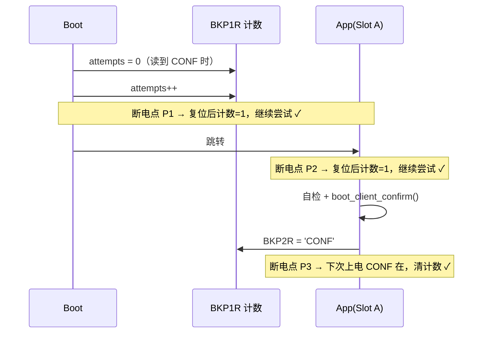

# 04 v0.1.0 Bootloader 实现详解

> [!NOTE]
> 本文档记录 **v0.1.0 已交付代码**的实现决策与难点，与 [01-architecture.md](01-architecture.md) 的分工是：架构文档回答"应该怎么做"，本文档回答"**实际怎么做的、为什么、哪里是妥协**"。代码位于 `Keil_OTA_Boot/`（Keil MDK-ARM + AC5 工程）。

## 0. 交付范围与代码地图

v0.1.0 的验收标准（见 [00-project-plan.md](00-project-plan.md)）：**STM32F407VGT6 真板上 Boot↔App 双向跳转成功**。只做跳转闭环，不含 Flash 擦写、传输协议、元数据区——那是 v0.2.0 起的事。

| 文件 | 职责 | 对应功能 |
|---|---|---|
| `Boot/boot_conf.h` | 分区表 / BKP 分配 / 魔数 / 阈值，单一事实来源 | — |
| `Boot/boot_flag.c/.h` | RTC 备份寄存器读写封装 | F-03 / F-04 / F-15 的数据层 |
| `Boot/boot_jump.c/.h` | 向量表校验 + 环境剥离 + 跳转 | F-01（简化版）/ F-02 |
| `Boot/boot_main.c/.h` | 主流程：确认消费 → 请求消费 → 计数保护 → 跳转 | F-03 / F-04 |
| `App/app_main.c` | fake_app：验证跳转闭环的最小应用 | — |
| `App/boot_client.c/.h` | 应用侧接口：init / confirm / request_update / heartbeat | F-03 / F-15 |
| `Core/Src/main.c` | CubeMX 生成，USER CODE 区接入 `boot_run()` | — |

三个刻意不做的事（对应架构文档铁律 R-1"允许写死、允许代码丑"）：

- **输出通道**：不引入 RTT/UART，验证靠 Keil 调试断点 + BKP 寄存器观察
- **固件校验**：只做 SP/PC 范围检查，不做 CRC/签名（理由见 §2.1）
- **A/B 切换**：单槽 A 写死，状态机不留接口

## 1. 跨复位通信：为什么用 RTC 备份寄存器

### 1.1 三种载体的对比

Boot 与 App 之间需要一条"复位后还在"的通信信道（请求升级 / 确认 / 计数）。候选：

| 载体 | 复位保持 | 写代价 | 掉电保持 | 结论 |
|---|:---:|---|:---:|---|
| 普通 SRAM | ✗ 随机值 | — | ✗ | 不可用 |
| No-Init RAM（`.noinit` 段） | ✓ | 零 | ✗ | 可用，但**无法区分"上电初始随机值"与"App 写入值"**，需要额外标记 |
| Flash 元数据区 | ✓ | 擦写周期 + 掉电安全设计 | ✓ | v0.3.0 的正解，v0.1.0 引入则过早 |
| **RTC 备份寄存器（BKP）** | ✓ | 单条寄存器写 | ⚠️ 仅接 VBAT 时 | **v0.1.0 选择** |

选 BKP 的三条理由：

1. **天然复位保持**：F407 的 20 个 32 位备份寄存器位于备份域，只受备份域复位影响，系统复位（含 `NVIC_SystemReset()`、看门狗、掉电重启）都不清零；
2. **写入零成本**：单条 STR 指令，无需擦写序列、无需 RAMFUNC 约束（对比 [01-architecture.md](01-architecture.md) §8.1）；
3. **魔数即校验**：上电初值固定为 0，与 `'REQB'`/`'CONF'` 魔数比较即可判断有效性，不需要 No-Init RAM 那套"先写标记再写数据"的协议。

> [!CAUTION]
> 备份域的掉电保持依赖 VBAT 引脚供电。开发板 VBAT 悬空或接了电池，行为不同：主电源断电后 BKP 内容可能丢失。本项目只要求**复位保持**（不断电），所以无影响；但排查问题时要知道这一层。

### 1.2 三步使能序列——每一步漏掉的症状

`boot_flag_init()` 的使能序列（顺序不可换）：

```c
__HAL_RCC_PWR_CLK_ENABLE();     /* ① PWR 外设时钟        */
HAL_PWR_EnableBkUpAccess();     /* ② PWR->CR.DBP = 1     */
__HAL_RCC_RTC_ENABLE();        /* ③ RTC APB1 接口时钟   */
```

| 漏掉 | 症状 | 原因 |
|---|---|---|
| ① | ② 写不进去：DBP 位操作被忽略 | PWR 寄存器本身无时钟 |
| ② | 写 BKPxR 静默丢弃，读回恒 0 | 备份域写保护（DBP）未解除 |
| ③ | 读写 BKPxR 读到 0 / 总线错误 | BKPxR 挂在 RTC 模块接口下，无 RTCEN 则访问无效 |

两个容易混淆的点：

- **BKPxR 不受 `RTC->WPR` 影响**。RTC 核心寄存器（计数器、闹钟等）有独立的 WPR 写保护序列，但备份寄存器只有 DBP 一道锁，解锁后直接读写；
- CMSIS 头文件里 F407 的备份寄存器是 **`RTC->BKP0R` … `RTC->BKP19R`** 逐个定义（部分老教程写 `BKPR[]` 数组，那是 F1 的访问方式，在 F4 上编译不过）。

### 1.3 寄存器分配与魔数设计

| 寄存器 | 用途 | 值域 |
|---|---|---|
| `BKP0R` | App 请求进入 Bootloader | 魔数 `'REQB'` = 0x52455142 |
| `BKP1R` | 连续启动尝试计数 | 0 ~ BOOT_MAX_ATTEMPTS |
| `BKP2R` | App 确认新固件健康 | 魔数 `'CONF'` = 0x434F4E46 |
| `BKP3R` | App 心跳计数 | 自由递增，仅供调试观察 |

魔数用 4 字符 ASCII 的好处：调试器 Watch 窗口里 hex 视图直接可读（`0x52455142` ↔ "REQB"），且天然远离 0 / 1 / 随机上电值的常见取值，防误判。

## 2. 跳转：boot_jump_slot 逐项讲透

### 2.1 校验：为什么 SP/PC 范围检查就够了

业界三档做法：

| 档位 | 校验内容 | 适用阶段 |
|---|---|---|
| 教程档 | SP/PC 范围检查 | 固件由 SWD 直接烧入，无传输误码 |
| 工程档 | 固件头 + CRC32/SHA256 | 固件经过有误码可能的传输链路 |
| 商用档 | 数字签名（Ed25519/ECDSA）+ 防回滚 | 对抗恶意构造的固件 |

v0.1.0 处在第一档，**不是偷懒而是逻辑必然**：当前固件由调试器完整写入，链路无损，CRC 校验的只是自己刚烧进去的东西——保护力为零。v0.2.0 引入 YMODEM 传输后，误码成为真实风险，CRC 才从"装饰"变成"刚需"。

范围检查的三条规则（`vector_table_valid()`）：

1. `SP == 0xFFFFFFFF` → 槽为空（擦除态），拒跳；
2. `SP` 不在 `[0x20000000, 0x20020000)` → 初始栈指针指向非 SRAM，跳过去第一次压栈即 HardFault；
3. `PC` 不在本槽范围内 → 入口不在本槽，说明槽内容不是合法向量表。

> [!TIP]
> VTOR 对齐约束是隐性前提：F407 的向量表要求 **1 KB 对齐**（VTOR 的 bit[9:0] 保留）。Slot A 基址 `0x08010000` 是 64 KB 对齐，天然满足。将来调整槽布局时，基址不是 1 KB 的整数倍会导致向量表重定位异常。

### 2.2 剥离清单：每一步不做的后果

对照 [01-architecture.md](01-architecture.md) §8.2 的清单，逐项给出"为什么"：

| # | 动作 | 代码 | 不做的后果 |
|---|---|---|---|
| 1 | `__disable_irq()` | `boot_jump.c` L50 | 剥离过程中断进来用旧向量表 + 快要换的旧栈 |
| 2 | 停 SysTick（HAL + 寄存器双保险） | L53-54 | App 重新 `HAL_Init()` 前每 1ms 一次中断打到旧向量表 |
| 3 | 清 NVIC **ICER + ICPR** | L57-61 | ICER 只关使能；**ICPR 不清则 pending 位还在**，App 一开中断立刻补枪 |
| 4 | 清 `FPU->FPCCR` 的 ASPEN/LSPEN | L64 | 见下方专述，网上教程最高频遗漏 |
| 5 | `__DSB()` `__ISB()` | L65-66 | 保证 3/4 的写真落地、指令流水线真冲刷 |
| 6 | `SCB->VTOR = slot_base` | L69 | 异常继续进 Boot 的向量表（Boot 已"不在"了） |
| 7 | `__enable_irq()`（**在换 MSP 之前**） | L73 | 见下方专述 |
| 8 | `__set_MSP()` + 函数指针跳转 | L76-77 | — |

**第 3 步的坑**：`NVIC->ICER[i] = 0xFFFFFFFF` 只是"关闸"，`ICPR` 里挂着的 pending 请求还在排队。App 启动后第一次 `__enable_irq()`（或它使能任何中断）时，这些积压请求会立刻触发——此时 VTOR 已指向 App，但 App 的外设初始化还没做，处理函数面对的是不存在的硬件状态。清 ICPR 是唯一正确姿势。

**第 4 步的原理**：Cortex-M4 的 FPU 有 lazy stacking（惰性压栈）机制——中断进入时只保留 8 字节栈帧空间不真正压 FPU 寄存器，等真正执行 FPU 指令才补压。这个"欠账"由 `FPCCR` 的 ASPEN/LSPEN 位使能。如果 Boot 的某个中断触发过 lazy stacking 状态、而跳转时不清这三位（`FPCCR` 还留着使能），App 换栈后 FPU 的状态机与真实栈不匹配，出现**随机位置、随机时刻的 HardFault**——典型表现为"跳过去能跑几百毫秒然后死"，极难定位。

**第 7 步的顺序**：Boot 在第 1 步 `__disable_irq()` 置了 PRIMASK=1。这个位**不会**被 `__set_MSP()` 或 App 的启动代码自动清除——它是 CPU 级状态，只有 `__enable_irq()` 或复位能清。若跳转前不恢复，App 一切中断永远不响应（HAL_Delay 卡死是第一症状）。而它必须**在换 MSP 之前**做：`__set_MSP()` 之后当前 C 函数的栈就废弃了，编译器随时可能把任何局部变量溢出到旧栈，之后再执行的语句都不可靠——`boot_jump.c` L71-72 的注释记录了这个约束。

### 2.3 与架构文档的分歧：C 函数指针 vs 汇编

[01-architecture.md](01-architecture.md) §8.2 要求跳转用一小段汇编（`msr msp` + `bx`）。**实际实现用了 C 函数指针**（L76-77），这是一处有记录的偏离：

```c
__set_MSP(sp);                  /* 换栈                          */
((void (*)(void))pc)();         /* 跳转，等效于 BX pc           */
```

成立的前提（AC5 / ARM Compiler 5.06 下的实测代码生成行为）：

1. `pc` 在寄存器里（此前无栈访问），函数指针调用编译为 `BX reg`，不压栈、不触旧栈；
2. `__set_MSP()` 内联为单条 `MSR`，其后到跳转之间没有任何栈访问。

> [!WARNING]
> 这是**靠编译器行为**的省事写法。换编译器（AC6 / GCC / IAR）或提高优化等级时，编译器有权在 `MSR` 之后插入栈操作（例如函数序言的压栈被延迟调度），届时将出现无法调试的间歇性崩溃。**迁移工具链时此处必须改回架构文档规定的汇编版本**，这是本仓库的已知技术债，v0.2.0 随 UART 移植一并偿还。

### 2.4 网上教程三处高频错误对照

排查全网 bootloader 教程时反复出现的三处错误，本实现均规避：

| 高频错误 | 症状 | 本实现 |
|---|---|---|
| 只清 ICER 不清 ICPR | App 开中断瞬间被积压请求打断 | L60 双写 |
| 不关 FPU lazy stacking | 随机位置 HardFault，"能跑几百 ms 然后死" | L64 |
| 先 `__set_MSP` 后 `__enable_irq` | App 中断全部失灵，HAL_Delay 死等 | L73 在 L76 之前 |

## 3. 计数先于跳转提交：掉电窗口分析

[01-architecture.md](01-architecture.md) §7.4 要求 `boot_attempts++` 必须发生在跳转**之前**。用断电点枚举法验证 v0.1.0 的流程（BKP 写入是单条 STR，本身原子）：



| 断电点 | 复位后状态 | 结果 |
|---|---|---|
| P1（计数后、跳转前） | 计数=1，无 CONF | 再试一次 |
| P2（App 跑起来但未确认） | 计数=1，无 CONF | 再试一次 |
| P3（已确认） | CONF 在 | 计数清零 |
| App 反复崩溃（每个周期 P2） | 计数累积到 3 | 拒跳，停留升级模式 |

不变式"**任意时刻断电，下次上电必然回到一个可启动的状态**"在每个断点都成立。唯一的边界情况：若 App 崩溃循环恰好每次都在 P3 确认之后——那是 App 自己确认了一个坏固件，属确认语义的信任问题（真实工程要求自检通过后才 confirm，见 §4.3），Boot 无法代偿。

## 4. App 侧配合：fake_app 起步三件事

`app_main.c` 的 main 入口顺序不可换：

```c
SCB->VTOR = BOOT_SLOT_A_ADDR;   /* ① 向量表重定位        */
__enable_irq();                 /* ② 恢复 PRIMASK        */
HAL_Init();                     /* ③ 常规初始化          */
```

### 4.1 为什么 App 要再设一次 VTOR

跳转前 Boot 已设过 `SCB->VTOR`，App 再设看似冗余，实为**双保险**，两者覆盖不同故障面：

- Boot 设：保证跳转后到 App 执行①之间的异常进对的向量表；
- App 设：使 App **脱离 Bootloader 也能独立运行**（调试器直接烧 App 到 0x08010000、或系统复位向量表被复位默认值覆盖的场景）。

### 4.2 已知局限：设置时机偏晚

标准做法是在 `system_stm32f4xx.c` 的 `SystemInit()` 里设 VTOR（`VECT_TAB_BASE/OFFSET` 宏），而本实现在 main 里设。差距窗口：`__main`（scatter-load 拷贝 .data/.bss 清零）到 main 之间若有异常，会进 Boot 的向量表——而 Boot 的代码此时仍然物理存在，Handler 大概率能"碰巧"工作。

v0.1.0 里该窗口**无任何中断使能**（PRIMASK=1 是②才清的，Fault 类异常在正常流程中不会来），风险实际为零；但这是靠流程保证的脆弱平衡，v0.2.0 收紧方式：改用 `VECT_TAB_OFFSET` 方案。

### 4.3 confirm 的语义约定

`boot_client_confirm()` 的契约：**只在自检通过后调用**。fake_app 无条件立即确认，因为它本来就是验证跳转用的空壳；真实工程应在完成关键外设初始化、业务自检后再确认——confirm 是 App 对"这版固件健康"的签名，乱用会绕过 F-04 回滚保护（见 §3 边界情况）。

## 5. 工程结构：为什么是两个独立 Keil 工程

### 5.1 双 target 方案的失败（决策记录）

最初尝试单 `.uvprojx` 双 target（`Keil_OTA_Boot` + `fake_app`）共享源码，失败现象极具迷惑性：

- XML 结构层面完全正确（文件分组、FileType、对称性逐项验证通过）；
- 但 UV4 命令行构建 `Keil_OTA_Boot` target 时，**把 fake_app 的全部文件也编译进来**：日志出现 `app_main.c`/`boot_client.c` 编译记录，共享源文件的对象被重命名为 `boot_flag_1.o`、`stm32f4xx_hal_1.o`（"object file renamed to _1"），链接时 203 个 multiply defined 错误；
- 删除 RTE 段手工添加的 targetInfo、删除 uvoptx、清理输出目录均无效；
- 同一文件构建单 target 工程则零错误——结论：**UV4 (MDK 5.38) 对手工构造的双 target 工程存在解析怪癖**，不可依赖。

### 5.2 拆分方案

| 工程 | 链接基址 | 产物 | 源码 |
|---|---|---|---|
| `MDK-ARM/Keil_OTA_Boot.uvprojx` | 0x08000000（sector 0-1） | `Keil_OTA_Boot\*.axf/.hex` | Core + Boot + HAL |
| `MDK-ARM/fake_app.uvprojx` | 0x08010000（sector 4-7） | `fake_app\*.axf/.hex` | Core + App + boot_flag + HAL |

两个工程同住 `MDK-ARM/` 目录，通过相对路径 `../Core`、`../Boot`、`../App`、`../Drivers` 共享源码，`boot_conf.h` 保持单一事实来源。命令行批编译：

```powershell
E:\Keil5\UV4\UV4.exe -b "Keil_OTA_Boot.uvprojx" -j0 -o boot.log
E:\Keil5\UV4\UV4.exe -b "fake_app.uvprojx"     -j0 -o app.log
```

> [!IMPORTANT]
> **烧录时两个工程都必须用默认的 Erase Sectors 模式**（Keil Flash Download 默认值）。Erase Sectors 只擦 hex 内容覆盖的 sector：Boot 烧录只擦 sector 0-1，App 烧录只擦 sector 4-7，互不伤害。若误选 Erase Full Chip，后烧的工程会把先烧的整个抹掉。

## 6. 上板验收手册

### 6.1 烧录与预期现象

1. Keil 打开 `Keil_OTA_Boot.uvprojx` → Flash → Download；
2. 打开 `fake_app.uvprojx` → Flash → Download；
3. 按 RESET。预期自动循环：Boot 跳 App → App 写 CONF → 心跳 5 秒（`FAKE_APP_AUTO_REBOOT_MS`）→ 写 REQB 复位回 Boot → Boot 停留升级模式（`boot_wait_update` 死循环）。

第 3 步停在升级模式是**预期行为**（REQB 被 Boot 消费后进入等待）。再按一次 RESET 才回到跳转循环（请求已被消费）。

### 6.2 调试器观察（Watch 窗口）

调试 Boot 工程，Watch 添加 `RTC->BKP0R` ~ `RTC->BKP3R`：

| 寄存器 | 复位后 Boot 阶段 | App 运行 5 秒内 | 回跳后 |
|---|---|---|---|
| BKP0R (REQB) | 0 | 0 → 复位前瞬间 `'REQB'` | 0（Boot 已消费） |
| BKP1R (计数) | 递增 +1 | `'CONF'` 写入后下次清零 | 保持/清零 |
| BKP2R (CONF) | `'CONF'` → 消费清零 | 自检后写 `'CONF'` | 0 |
| BKP3R (心跳) | 不动 | 每 100ms 递增 | 停在最后值 |

### 6.3 F-04 拒跳实验

把 `boot_conf.h` 的 `BOOT_MAX_ATTEMPTS` 改为 `0u` 重烧 Boot：Boot 每次上电计数后立即超限，永远拒跳、停在升级模式——验证回滚保护的触发路径，且不需要真的做坏固件。

## 7. 已知妥协清单

| # | 妥协 | 为什么现在可接受 | 计划收紧 |
|---|---|---|---|
| 1 | 跳转用 C 函数指针而非汇编 | AC5 实测代码生成不触旧栈 | v0.2.0 改汇编（§2.3） |
| 2 | App 的 VTOR 在 main 而非 SystemInit 设置 | 窗口期内无中断使能，风险为零 | v0.2.0 改 VECT_TAB_OFFSET（§4.2） |
| 3 | 校验只有 SP/PC 范围检查 | 无传输链路，CRC 无保护对象 | v0.2.0 固件头 + CRC（§2.1） |
| 4 | Boot 使能的 PWR/RTC 时钟未关就跳转 | BKP 需跨跳转存活（关 PWR 时钟反而错）；App 重配时钟树 | v0.2.0 按"App 不知情且会干扰"标准逐外设反初始化 |
| 5 | Boot target 的 IROM 仍为设备默认 1 MB | 实际占用 3.4 KB，Erase Sectors 只擦覆盖扇区 | 需要 v0.3.0 写保护时一并收紧为 32 KB |

---

相关文档：[00-project-plan.md](00-project-plan.md) · [01-architecture.md](01-architecture.md) · [02-git-and-github.md](02-git-and-github.md) · [03-code-style.md](03-code-style.md)
