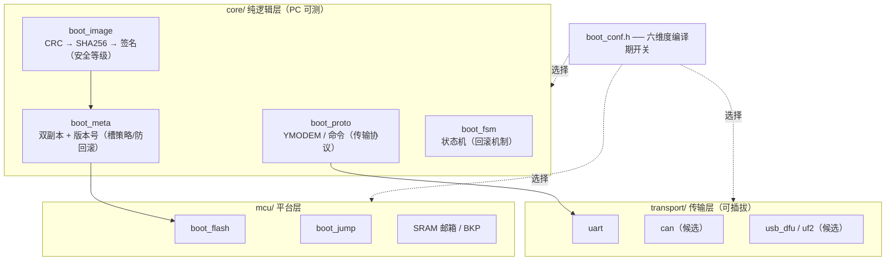

# 🔍 05 主流 Bootloader 生态对标与裁剪矩阵

 

> 📚 **系列导航**：[00 规划](00-project-plan.md) · [01 架构](01-architecture.md) · [02 Git](02-git-and-github.md) · [03 风格](03-code-style.md) · [04 实现](04-boot-implementation.md) · [05 对标](05-bootloader-landscape.md)

> [!NOTE]
> 本文档回答两个问题：**网上主流的纯 MCU Bootloader 都长什么样**；以及本项目如何**有纪律地包揽它们的能力**——目标不是运行时大而全，而是源码仓库全、构建时按需裁剪。路线以 [00-project-plan.md](00-project-plan.md) 为准，本文档只做对标与扩展方向分析。

## 🌍 1. 主流实现全景

| 项目 | 许可 | 核心特性 | 对本项目的借鉴点 |
|---|---|---|---|
| **MCUboot** | Apache-2.0 | 签名（Ed25519 / ECDSA / RSA）、固件加密、三种升级策略（swap-move / swap-scratch / overwrite-only）、serial recovery | 槽管理策略分类学；镜像头 TLV 格式；防回滚版本号 |
| **OpenBLT** | GPL / 商业双许可 | 多传输（RS232 / CAN / USB / TCP）、backdoor 入口、看门狗集成、配套上位机 MicroBoot | 传输层可插拔的接口设计；backdoor 魔数入口 |
| **stm32-bootloader**（高星社区项目） | GPL-3.0 | 跨 STM32 F0~H7 全系、UART/CAN/I2C/SPI/USB 多协议、纯寄存器零依赖、Python 端到端测试 | **与本项目形态最接近的参照**：多协议供选择；PC 端测试先行 |
| **ST X-CUBE-SBSFU** | ST 许可 | 签名验签（PKA 硬件加速）、AES-GCM 加密固件、防回滚、双区交换 | 安全启动链；安全能力分级（L1→L4）的做法 |
| **ST AN4023 IAP 示例** | ST 许可 | UART + YMODEM 最小实现 | v0.2.0 传输协议的原型 |
| **TinyUF2**（Adafruit） | MIT | USB MSC 拖拽升级（.uf2 文件当 U 盘拷入即烧录） | 用户体验天花板；远期传输层选项 |
| **STM32 ROM Bootloader**（AN2606） | 无需代码 | 芯片出厂自带，BOOT0 拉高进入，支持 UART/I2C/SPI/USB DFU | **零代码基线**：任何自研 Bootloader 都应回答"相比 ROM 自带的，多给了什么" |
| **ESP32 second-stage bootloader** | Apache-2.0 | CSV 分区表、看门狗超时自动回滚、加密侧载 | CSV 分区表（改布局不动代码）；试运行（pending test）回滚语义 |

> [!TIP]
> "相比 ROM 自带 Bootloader 多给了什么"——本项目的答案：A/B 双槽掉电安全、App 侧确认/回滚语义、可在 PC 上验证的升级状态机。这三条 ROM Bootloader 都没有，也是本项目存在的理由。

## ✂️ 2. 六个裁剪维度

从上表提炼出可独立裁剪的六个维度，**裁剪 = 编译期关掉 `boot_conf.h` 的开关，而不是删代码**：

| 维度 | 可选项 | 默认（本项目） |
|---|---|---|
| 传输通道 | UART-YMODEM / CAN / USB-DFU / USB-MSC(UF2) / 空（仅跳转） | UART-YMODEM |
| 槽策略 | 单槽 / A/B overwrite-only / A/B swap | A/B overwrite-only（切换仅提交元数据） |
| 安全等级 | L0 无 / L1 CRC / L2 SHA256 / L3 签名 / L4 签名+加密 | v0.2 达 L1；v0.4 达 L3 |
| 回滚机制 | 无 / 看门狗超时 / 计数器确认 / 版本号防回滚 | 计数器确认（F-04），v0.4 加防回滚 |
| 入口方式 | 上电直跳 / 超时窗口 / 按键 / backdoor 魔数 / App 回跳请求 | App 回跳请求（F-03），超时窗口候选 |
| 元数据存放 | 无 / BKP 寄存器 / `.noinit` SRAM 邮箱 / Flash 元数据区 | SRAM 邮箱（运行期）+ Flash 元数据（持久期） |

## 🧩 3. 仓库架构如何容纳这些选择

现有分层（见 [01-architecture.md](01-architecture.md)）与六维度的对应关系：

- **传输通道** → transport 层换实现，core 的 `boot_proto` 不动；
- **安全等级** → `boot_image` 内部逐级启用（L1 已在 v0.2 路线）；
- **槽策略 / 回滚** → `boot_meta` + `boot_fsm` 的编译期变体；
- **入口 / 元数据存放** → `mcu` 层 + `boot_conf.h`。

## 🗺️ 4. 分版本对标路线

与 [README 路线图](../README.md#️-路线图) 一一对应，每个版本标注"达到哪个对标项目的哪项能力"：

| 版本 | 本项目内容 | 达到的对标能力 |
|:---:|---|---|
| v0.1.0 ✅ | 双向跳转闭环 | AN2606 ROM 的"能进能跳"+ 独有的 App 确认语义 |
| v0.2.0 🚧 | UART + YMODEM、Flash 双槽、元数据双副本、CRC | **AN4023 全量 + 其不具备的掉电安全元数据** |
| v0.3.0 | 掉电安全状态机 + 计数回滚 | stm32-bootloader 的测试方法；ESP32 的试运行回滚语义 |
| v0.4.0 | Ed25519 签名 + 防回滚 | **MCUboot / SBSFU 的安全能力**（曲线更小：Ed25519 vs ECDSA） |
| v0.5.0 | Python 上位机（pip 可装） | OpenBLT 的 MicroBoot 定位 |
| v1.0.0 | 接口冻结 + 完整文档 | — |
| v1.0+ 候选 | CAN 传输（已列增强）、USB-DFU / UF2 拖拽、CSV 分区表 | stm32-bootloader 的多协议广度；TinyUF2 的体验；ESP32 的分区表 |

> [!IMPORTANT]
> "候选"不等于承诺。v1.0 之后的扩展一律**先接口后实现**：transport 层定义好 `transport_if`，每个新传输先提交接口与迁移指南，实现按社区需求排期——避免单人维护被广度拖垮。

## 📜 5. 两条工程纪律

1. **配置开关必须是编译期 `#if`**——Bootloader 保持零动态性（无函数指针表按运行时条件切换），这是 [03-code-style.md](03-code-style.md) 既有纪律的延续。MCU 资源有限，"裁剪"发生在链接期：没选中的模块根本不进固件。
2. **每维度先只交付一种默认实现**——其余选项以"接口 + 占位文档"存在。仓库的"包揽感"来自 §2 的裁剪矩阵与对标文档，而不是未验证的代码堆积；这正对应 [00-project-plan.md](00-project-plan.md) "无'理论可用但没在真板验证'的分支"的定位。

---

相关文档：[00-project-plan.md](00-project-plan.md) · [01-architecture.md](01-architecture.md) · [03-code-style.md](03-code-style.md) · [04-boot-implementation.md](04-boot-implementation.md)
